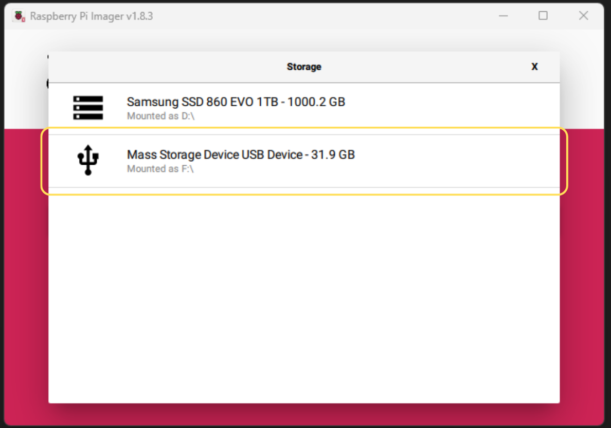
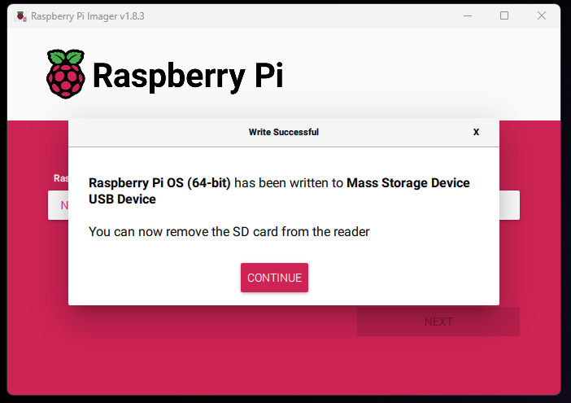
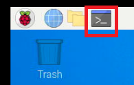
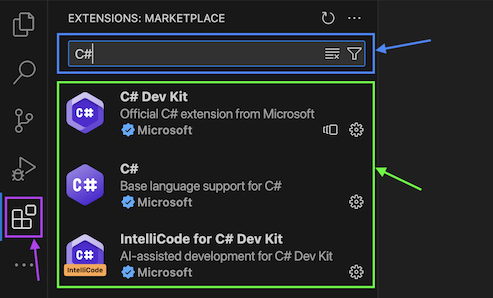

This guide will go through how to set up the software on your Raspberry Pi, including how to:

- Download and burn Raspberry Pi OS to an SD card.
- Install Raspberry Pi Operating System (OS).
- Install programs and tools used in the next chapters (continued on next page).

## 1. Download Raspberry Pi OS

:::tip[Want a pre-built image?]

The following steps get you to set up the software yourself. We recommend that you do this. However, if you need to, we also provide an image with everything already set up. Download the [FieldGuidePiImage.v1.0.img.gz](https://drive.google.com/file/d/1ieeTv6dVV7zv5vittwb82crd_wih2DPj/view?usp=share_link). Unzip it, and use this as the image you copy to the SD card in the steps below. There is a **student** user with password **student** on this Image. Please make sure to change the password.

:::

Follow the steps below to download the recommended Raspberry Pi OS:

1. Download and install the Raspberry Pi Imager from [raspberrypi.org](https://www.raspberrypi.org/software/)
    - Select the version for your operating system.
    - Run the installer and follow the instructions.
2. Insert the micro SD card into your computer.
    - You may need a Micro SD card adapter and/or a USB SD card reader.
    - We recommend using a micro SD card with a size of at least 16 GB (32 GB preferred).
3. Open the Raspberry Pi Imager.
4. Click CHOOSE OS.

    

5. Select Raspberry Pi OS (64b-bit)

    

    :::tip
    If you are using the prebuilt image, choose **Use custom** at this point and select the **FieldGuidePiImage.v1.0.img** file you downloaded. When this finishes copying onto the SD card you are all done. Just plug it into your Pi and get going.
    :::


6. Click storage and select the micro SD card and click next.

    :::danger[Which Device should I select?]
    Make sure you select the correct storage device. Selecting the wrong device will result in the data on that device being erased.

    In the image below we are using a 32 GB micro SD card connected via a USB SD card reader:

    

    :::

7. Click `No` to the question "Would you like to apply OS customisation setting?
    - Optionally you can click edit settings to preconfigure options like the hostname, password, and Wi-Fi settings. Click yes if you want to do this.
8. Click `Yes` to the question Are you sure you want to continue?
    - **WARNING**: This will erase all data on the selected storage device.
9. Wait until the Raspberry Pi Imager has downloaded, written and verified the image on micro SD card. (This may take a while)
10. Click continue and remove the micro SD card from your computer.

    

## 2. Install Raspberry Pi OS

Follow the steps below to install the Raspberry Pi OS on the micro SD card:

1. Insert the micro SD card into the Raspberry Pi and power on. (See [Build my Raspberry Pi](./1-0-pi-computer.md) for setup instructions)
2. On the Welcome screen click next.
3. Set your country, language and time zone and click next.

    :::note[Important!]
    For the correct keyboard layout that is used for most Australian-produced keyboards (and the Raspberry Pi Keyboard that we are using), make sure to **_tick_** the option: "**Use US keyboard**", as shown in the image below.
    :::

    

4. Set your username and password, click next.

    

5. \*\*Optional\*\*  
   Select Wi-Fi network and enter password, click next.

    

6. Select your preferred browser: Chromium or Firefox, Click next.

    

7. \*\*Optional\*\*  
   Update Software, Click next.

    :::tip[Reduce initial setup time]
    This process will take some time to complete.

    Click "Skip" to perform this task later.
    :::

    

8. Click restart.

9. After the reboot you will be presented with the Raspberry Pi Desktop:

    

10. Raspberry Pi OS Install Complete!

## 3. Setup Raspberry Pi OS

_Let's get your Raspberry Pi ready to start coding_

This section will go through all the steps to install the required Applications and Tools that you will need to code in C# and C++ with SplashKit.
To make things easier we have an automated script for fresh installs that will install all the required tools and applications for you or you can follow the manual steps below.

:::note[How do I open the Terminal on my Pi?]
_Click the Terminal icon in the task bar or press `Ctrl + Alt + T`_ 
:::

### Automated Setup

This script will install the following applications and tools:

- Visual Studio Code
  - C/C++ Extension
  - C# Extension
- .NET SDK
- SplashKit
  - SplashKit Global
- wget
- git
- curl
- clang

1. Open the Terminal.
2. Run the following command. The scrip will take a while to run (approx. 12-15 mins)

```bash
curl -s "https://raw.githubusercontent.com/splashkit/the-programmers-field-guide/main/src/content/docs/book/part-0-getting-started/2-computer-use/2-put-together/scripts/_Linux_Pi_InstallScript.sh" | bash /dev/stdin
```

3. Close and Reopen the Terminal. Type `skm` to check SplashKit is installed correctly.

:::tip[Using options with the script]
The linux_pi_install script supports a number of options that can be used to customise the installation.
They can be added to the end of the command. The example below will display the help menu which lists the available options.

```bash
curl -s "https://raw.githubusercontent.com/splashkit/the-programmers-field-guide/main/src/content/docs/book/part-0-getting-started/2-computer-use/2-put-together/scripts/_Linux_Pi_InstallScript.sh"| bash /dev/stdin --help
```

:::

### Manual Setup

#### 1. Install the SplashKit SDK

SplashKit is a beginner's all-purpose software toolkit that will allow you to create fun and exciting programs more easily, especially for Graphical User Interface (GUI) programs.

:::tip[Curious to know more?]
The **SplashKit SDK** is installed using the `skm-install.sh` shell script which is stored in the [**skm**](https://github.com/splashkit/skm) GitHub repository (in the **install-scripts** folder).

It will also add the required paths to your PATH environment variable.
:::

1. Copy and paste the following command into your Terminal window:

```bash
bash <(curl -s https://raw.githubusercontent.com/splashkit/skm/master/install-scripts/skm-install.sh)
```

2. Close and reopen the Terminal.
3. Run this command to build SplashKit on the Pi _(This will take a while approx. 10 mins)_

```bash
skm linux install
```

Type `y` and press enter to confirm the installation.


Finally, Install the SplashKit Global Libraries. This will install the SplashKit libraries and library include files into the system default global locations so that when building (compiling) programs created with SplashKit, the compiler can find these files automatically.

```bash
skm global install
```

:::note[What does this command do specifically?]
The command above will add the **SplashKit libraries** into the `/usr/local/lib/` folder, and the required **SplashKit library include files** into the `/usr/local/include` folder.
:::

:::danger[My install command is not working. Help!]
What if the command above does nothing? (as shown in the image below)


Make sure your computer is connected to the internet.

**_Still no luck?_**  
Download the install script locally by right-clicking on [this link](https://raw.githubusercontent.com/splashkit/skm/master/install-scripts/skm-install.sh) and selecting "Save Link As".

To run the downloaded shell script, open the Terminal and navigate to the folder where you saved the file and then use the command: `bash skm-install.sh`.  
For example, if the file is in your _Downloads_ folder:

:::

#### 2. Install Visual Studio Code

Visual Studio Code, also commonly known as _VS Code_ or just _Code_, is a powerful and versatile code editor that enables efficient coding, debugging, and collaboration for your SplashKit projects!

:::note[VS Code has it all!]
Once you have your code project set up, Visual Studio Code will be the main program you will use to write, build, run and debug your code.
:::

Run the following command in the Terminal to install Visual Studio Code:

```bash
sudo apt install code
```


:::tip[Open Code from Terminal]
You can open Visual Studio Code from the Terminal by typing `code` and pressing enter.
`code .` Will open the current folder in Visual Studio Code.
:::

##### C# Language Extensions

For **C#** code, we recommended that you install the `C#`, `C# Dev Kit` and `IntelliCode for C# Dev Kit` extensions.

:::tip[How do I install the C# extensions?]

1. Open Visual Studio Code and click on the icon in the left panel (shown in the purple box in the image below).
2. Type "C#" in the Search bar at the top (shown in the blue box).
3. Click "Install" for each of the extensions listed (shown in the green box).


:::

##### C++ Language Extensions

For **C++** code, we recommended that you install the `C/C++` extension.

You can also install the `C/C++ Extension Pack` extension which includes multiple extensions bundled together. If you have issues with syntax highlighting, the `Better C++ Syntax` extension is one of the best for this.

:::tip[How do I install the C++ extensions?]

1. Open Visual Studio Code and click on the icon in the left panel (shown in the purple box in the image below).
2. Type "C++" in the Search bar at the top (shown in the blue box).
3. Click "Install" for the "C/C++" extensions (shown in the green box).
4. (Optional) Click "Install" for any other extensions you want to install (shown in the orange box).


:::

#### 4. Install Language Specific Tools

Some coding languages require specific tools/frameworks to be installed to be able to build and run your code files.  
As you will be coding in C# and C++ in this book, let's look at the tools needed for these languages:

##### C# Tools

For coding in C#, you will need to install the `.NET` framework, also commonly called _dotnet_.  
You will use this to create, build, and run your C# project code.

:::tip[Which version should I use?]
We recommend using **.NET 8.0**, which you can be installed with the following command:

```bash
curl -sSL https://dot.net/v1/dotnet-install.sh | bash /dev/stdin
```

You will also need to add .dot to your PATH environment variable.

```bash
echo 'export DOTNET_ROOT=$HOME/.dotnet' >> ~/.bashrc
echo 'export PATH=$PATH:$HOME/.dotnet' >> ~/.bashrc
source ~/.bashrc
```

Test dotnet is installed correctly by running `dotnet --version` in the Terminal.
For more details on the process refer to this article [Deploy .NET apps on ARM single-board computers](https://docs.microsoft.com/en-us/dotnet/iot/deployment)

:::

##### C++ Tools

For coding in C++, you will need to have a C++ compiler installed to build your C++ code into a file you can use to run your program.  
Commonly used compilers are `g++` and `clang++`.
`g++` is installed by default on the Raspberry Pi to install `clang++` run the following command:

```bash
sudo apt install clang -y
```

### Optional Steps

:::tip[What is nano?]
Nano is a command line text editor that is installed by default on the Raspberry Pi. It has a number of features but as a quick start these are the most important commands

- To edit a file in nano use `nano [filename]`
- navigate the cursor using the arrow keys
- `Ctrl + O` to save the file
- `Ctrl + X` to exit the editor
  :::

#### Setup zhs shell

When using the terminal you are actually interacting with a shell the default for the Raspberry Pi is bash, but there are other shells available.
Here we will install zsh and oh-my-zsh to customise the terminal. These will give you a more user-friendly terminal experience with themes and plugin support.

Install zsh

```bash
sudo apt install zsh -y
```

Install oh-my-zsh


```bash
sh -c "$(curl -fsSL https://raw.githubusercontent.com/ohmyzsh/ohmyzsh/master/tools/install.sh)"
```

Answer `y` to the question `Do you want to change your default shell to zsh?`

Add SplashKit and dotnet to the PATHs to zhs

```bash
echo "export PATH=$PATH:$HOME/.dotnet" >> ~/.zshrc
echo "export DOTNET_ROOT=$HOME/.dotnet" >> ~/.zshrc
echo "export PATH=$PATH:$HOME/.splashkit" >> ~/.zshrc
source ~/.zshrc
```

:::note[You may need to restart the PI for the terminal to update]
:::

##### Plugins

There are a number of plugins available for oh-my-zsh to add additional functionality to the terminal. To install a plugin you need to add it to the plugins list in the `~/.zshrc` file.

(https://github.com/ohmyzsh/ohmyzsh/wiki/Plugins) has a list of pre-installed plugins although there are others are available.


For example to use autojump first install it with:

```bash
sudo apt install autojump -y
```

Then add it to the plugins list in `~/.zshrc`

```bash
nano ~/.zshrc
```

Navigate to the plugins line and add `autojump` to the list git will be listed already, use a space to separate the plugins.

```bash
plugins=(git autojump)
```

