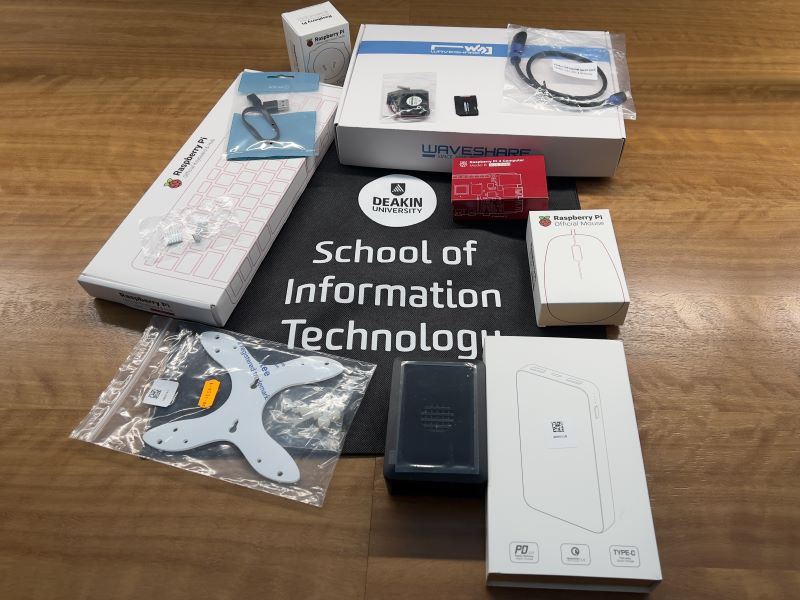
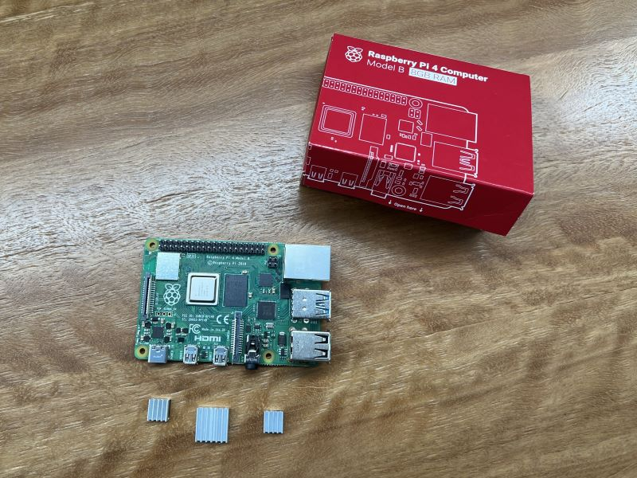
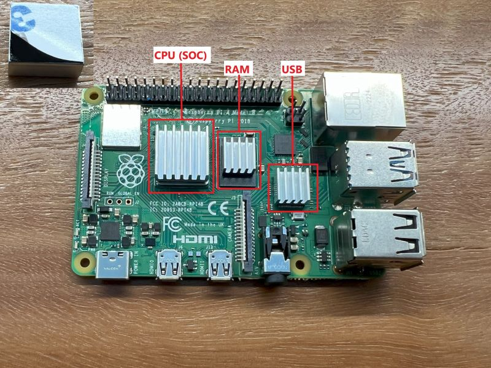
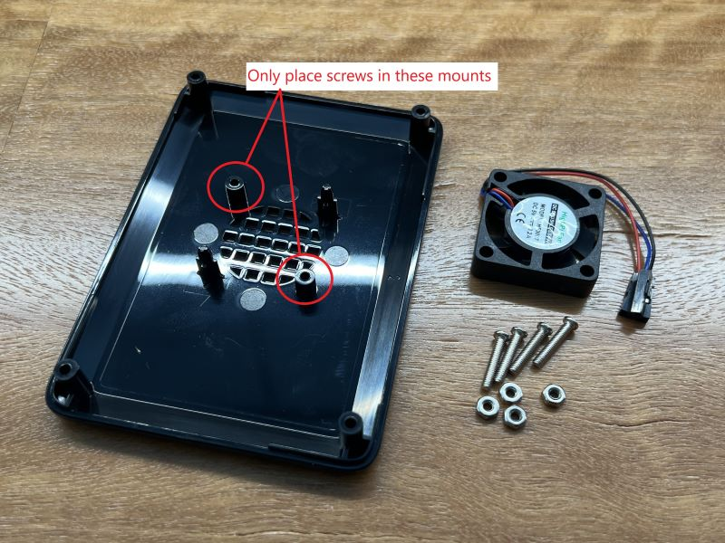
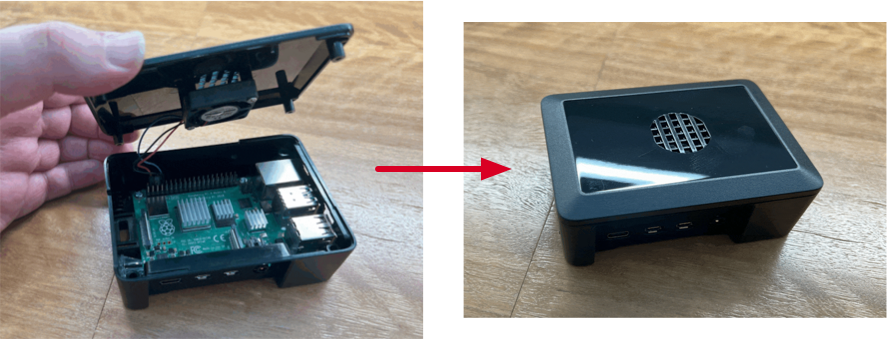
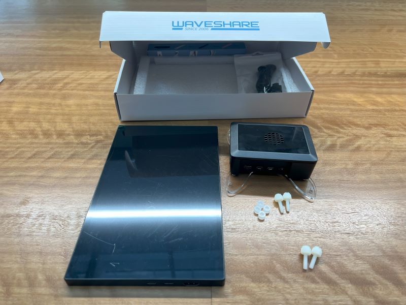
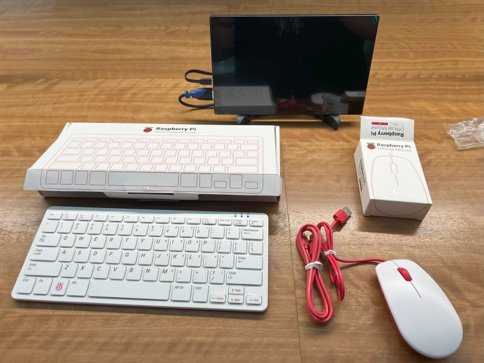
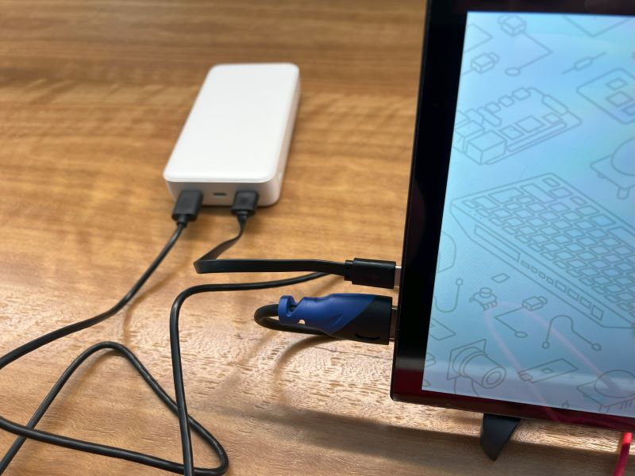

Building programs really requires that you have access to a computer that you can play around with. To maximise your experience, we have designed things to work with a [Raspberry Pi](https://www.raspberrypi.com) single board computer.

Using the *Raspberry Pi* Multi-tool will give you several advantages:

- You can play around with Unix without risking your day-to-day computer (which you can switch to Linux once you are more confident)
- The Raspberry Pi include pins for **General Purpose Input / Output** (**GPIO**) though a [40-pin header](https://www.raspberrypi.com/documentation/computers/raspberry-pi.html#gpio-and-the-40-pin-header) on the board:
  
  
  
  We can use this to interact with electronics and see how we can control things in the real world using code.
- Playing with a Raspberry Pi is just more fun 😁.

:::note[Where do you get one of these multi-tools?]
You don't. You *build it yourself*.

The next couple of pages will go over how to build and configure the multi-tool. You can then use it for the activities in the next chapters.
:::

We will first look at the hardware you need, and where you can get it, and then we can look at the software you need and how you can install that using the [Terminal](../../1-concepts/01-terminal) on your Pi.

:::caution[Alternatives to the multi-tool]
Not sure if you want the hardware, but still want to set something like this up? There are some alternatives.

Rather than getting a new physical machine, you can download virtual machine software and follow the software setup to get it working in there.
<!-- Add link to (./2-0-setup-linux) once that page has been completed -->
:::

Let's get going!

## 1. Getting the Hardware

There are many hardware and component choices you can make building your Raspberry Pi multi-tool. Our selection is a self-contained unit using off-the-shelf parts that can run off a battery. Depending on your needs, you may forgo some choices, like the battery or the display.

### Suggested components

This is the list of components we used to build our multi-tool with links to Australian retailers where they can be purchased.

- 1 x [Raspberry Pi 4 Model B 8GB](https://core-electronics.com.au/raspberry-pi-4-model-b-8gb.html)
- 1 x [Raspberry Pi 4 Power Supply (Official) - USB-C 5.1V 15.3W (White)](https://core-electronics.com.au/raspberry-pi-4-official-power-supply-usb-c-5v-15w-white.html)
- 1 x [MicroSD Memory Card - 32GB Class 10](https://core-electronics.com.au/microsd-memory-card-32gb-class-10.html)
- 1 x [Pi Hut Modular Raspberry Pi 4 Case - Black](https://core-electronics.com.au/pi-hut-modular-raspberry-pi-4-case-black.html)
- 1 x [3pc Heatsink Kit for Raspberry Pi 4](https://core-electronics.com.au/3pc-heatsink-kit-for-raspberry-pi-4.html)
- 1 x [HighPi Pro 5V Cooling Fan](https://core-electronics.com.au/highpi-pro-5v-cooling-fan.html)
- 1 x [Raspberry Pi Keyboard - Red/White](https://core-electronics.com.au/raspberry-pi-keyboard-red-white.html)
- 1 x [Raspberry Pi Mouse - Red/White](https://core-electronics.com.au/raspberry-pi-mouse-red-white.html)
- 1 x [10.1inch Capacitive Touch Display](https://littlebirdelectronics.com.au/products/10-1inch-capacitive-touch-display-wide-color-gamut-1280x800-optical-bonding-toughened-glass-panel-hdmi-type-c-display-interface)
- 1 x [0.5m Micro-HDMI Cable (HDMI Type-A to Type-D)](https://www.cablechick.com.au/cables/05m-micro-hdmi-cable-hdmi-type-a-to-type-d.html)
- 1 x [USB Type-C Short Sync & Charge Flat Cable 20cm](https://core-electronics.com.au/usb-type-c-short-sync-charge-flat-cable-20cm.html)
- 1 x [ModMyPi Modular RPi 2 Case - VESA Splash (75/100mm)](https://core-electronics.com.au/modmypi-modular-rpi-2-case-vesa-splash-75-100mm.html)
- 1 x [USB C Power Delivery Battery Bank 20000mAh](https://core-electronics.com.au/usb-c-pd-battery-bank-20000mah.html)

## 2. Building your multi-tool

:::tip
Using your own SD card? Make sure you have installed Raspberry Pi OS on it. You can find the instructions in the [Set up my Raspberry Pi](/book/part-0-getting-started/2-computer-use/2-put-together/2-1-setup-pi/) section.
If we have provided you with an SD card, it will already have the OS installed.
:::

Check you have all the components listed above, or equivalent alternatives.

Here is what the components above look like:

### Prepare the Raspberry Pi board

To help prevent the Raspberry Pi from overheating, it is a good idea to use something called a [**heat sink**](https://en.wikipedia.org/wiki/Heat_sink) on the areas that are most likely to get hot when in use.

Locate the Raspberry Pi and 3 piece heatsink kit. Remove the Pi from its packaging.

Peel the backing off the heat sinks and stick them to the Pi.

:::note
The largest heatsink goes on the CPU(SOC), the two smaller ones go on the RAM and USB chips (as shown below):

:::

### Secure the Raspberry Pi into the Case

Now we need to put the board inside the case so that we can access the ports, and attach the board to the screen in the next step.  
*Note: You will need a small Phillips Head screwdriver for some steps in this part.*

Open the black Raspberry Pi case (and put the screws and feet aside for the moment).

:::tip[Insert the Pi into the case]
This case is a bit fiddly to get the Pi in correctly, but it doesn't require much force.

- Place the Pi in the case
- Align the network port with the opening.
- Apply a little pressure to the back of the USB ports, the headphone jack should slide into place.
- Push the board across so the USB-C power and Mini HDMI ports are seated correctly.
- All 4 Pi screws should line up with the holes in the case.

:::

To keep the Raspberry Pi from moving around, use the screwdriver to screw the four **short screws** through the yellow circles on the board to secure the Pi to the case:

### Install the cooling fan on Case Lid

The case we have suggested allows for you to attach a cooling fan. Similar to the heat sinks mentioned above, this will help prevent the board from overheating and running slower.

Peel the plastic protective layer off the lid of the case, and place it on your work space upside down (as shown below). Take the fan out of its packaging, as well as the four included screws.

Place the fan on the case mounts with the label facing up and use **two** of the screws to secure it in place using the two mounting holes shown above.

:::note
Facing the label up will ensure the fan blows air into the case.  
Only two screws are required to secure the fan. The other two screws and the four nuts are not required.  
Ensure the fan cable is close to one of the long sides.  

:::

To power the cooling fan, you will need to connect the fan to the GPIO pins on the Pi. (See image at top of this document for pin locations)

Put the case lid and secured fan next to the base part of the case, and connect the 3 wires to the following GPIO pins:

- *Red* wire to pin 4 (5V)
- *Black* wire to pin 6 (Ground)
- *Blue* wire to pin 8 (GPIO14)

You should now have something that looks similar to this:

Lastly, place the lid on the case, ready for the next step:

### Attach VESA Mount to Case

This next step will allow you to attach your Raspberry Pi's Case to the back of the screen which will allow it to be more portable.

Open the VESA mount packaging and peel the protective layer off the VESA mount (as shown below).  
*Keep the nylon screws/spaces aside for the next part.*

<!--  -->

<!--  -->

Secure the VESA mount to the case using the four **long screws** that were included in the packaging for the Case. This will also keep the case lid securely attached.

:::danger[Important!]

- Make sure to line up mount so that the 75 x 75mm VESA mount holes are on opposite side to the USB-C and Mini HDMI ports.
- It doesn't matter if the mount is flipped (as it is in the image above), as the middle holes won't be used.

:::

### Insert the Micro SD Card

Due to the position of the Micro SD card slot on the Raspberry Pi, it is easier to insert the Micro SD card at this point, while it is more easily accessed.

To insert the Micro SD card into the Raspberry Pi:

- Remove the Micro SD card form the SD card adapter.
- Position the Pi with the VESA mount on top.
- Insert the SD card into the Pi with the label facing up.

## 3. Connecting the Accessories

To interact with the Raspberry Pi's Operating System, we will need to connect the **Screen**, **Keyboard**, and **Mouse** to the Pi in a *somewhat specific* way. These steps below will guide you through the correct set up.

### Attach the Display Screen with VESA mount

Take the screen out of its box, and grab the nylon screws/spaces from the VESA mount that we put aside earlier:

:::danger[Important!]
Make sure the SD card is inserted before connecting the screen, or you will likely need to remove the screen to insert it.
:::

To attach the Raspberry Pi to the display screen:

- Face the top of the screen towards yourself
- Place two of the spacers on the VESA mount holes on the screen closets to the top.
- Place the Pi on top of the spacers.
- Place the other spaces on the nylon screws
- Secure the Pi to the screen using the two nylon screws and four spacers. You can use your fingers to tighten the screws.

Here are some images to help you follow along:

Next, locate the **Micro HDMI to HDMI** and **20 cm USB-C to USB-A** cables (as shown below):

For the **20 cm USB-C to USB-A** cable:

- Connect the USB-C end to the Screen's "Display & Touch" port.
- Connect the USB-A end to one of the USB-A ports on the end of the Pi.

For the **Micro HDMI to HDMI** cable:

- Connect the Micro HDMI to the Pi's **first** HDMI port (closest to the power USB-C port).
- Connect the full-size HDMI to the Screen's "HDMI" port.

:::tip[Recommendations]

- Make sure the Micro HDMI is connected to the first port as shown in the images above. Using the second HDMI port may cause sound issues.
- Putting a loop in the cable will help with cable management.

:::

The suggested screen comes with a handy little stand so that you can set it up easily on a table or desk.

Remove the stand from it's packaging and bend into the shape shown in the image below:

Place the display screen on the stand.

*Note: It can be a challenging to get the screen to sit correctly, so you may need to fiddle with the cables:*

### Connect the Keyboard and Mouse

To allow you to use the Raspberry Pi and screen in the same way you would use a regular computer/laptop, we need to connect the keyboard and mouse.

Locate your **Raspberry Pi Official Keyboard** and **Raspberry Pi Official Mouse**:

Using the cable in the keyboard box, connect the **micro USB** end to the micro USB port on the keyboard, and the **USB-A** end to one of the black USB-A ports (USB 2.0) on the Pi.

## 4. Powering the Multi-tool

There are multiple configurations you can use to power the multi-tool.

### Using Mains Power

The easiest way to power the multi-tool is to use the power supply that came with the Pi.

**To use mains power:**

- Connect the USB-C end to the Pi's USB-C power port.
- Plug the other end into a power outlet.

:::tip
Fold the screen down to plug in the power supply.
:::

### Using Battery Power

If you are on the go or want to use the multi-tool in a location without power, you can use a battery/power bank.

**To use battery power:**

- Locate the longer USB-C to USB-A cable.
- Connect the USB-A end to the power bank.
- Connect the USB-C end to the Pi.
- The power bank will turn on automatically.

:::note
For intense workloads you may need to connect the display directly to the battery bank rather than via the Pi.

This can be done either with the supplied USB-C to USB-C cable or using the 20Cm USB-C to USB-A cable. *(Note that will disable the touch functionality of the screen.)*

Here is the setup using the **USB-C to USB-C cable**:

And here is the setup using the **20 cm USB-C to USB-A cable**:

:::

## 5. Finalising the Mutli-tool Setup

Almost done, just a few final touches!

### Tidying up

To make the cables a bit neater, you can use the cable ties from the packaging to secure the cables together:

### Complete Setup

You should now have a fully constructed Raspberry Pi multi-tool.

To continue the setup process, continue to the next page: [Set up my Raspberry Pi](/book/part-0-getting-started/2-computer-use/2-put-together/2-1-setup-pi/) for instructions on how to install the operating system and configure the Pi.
