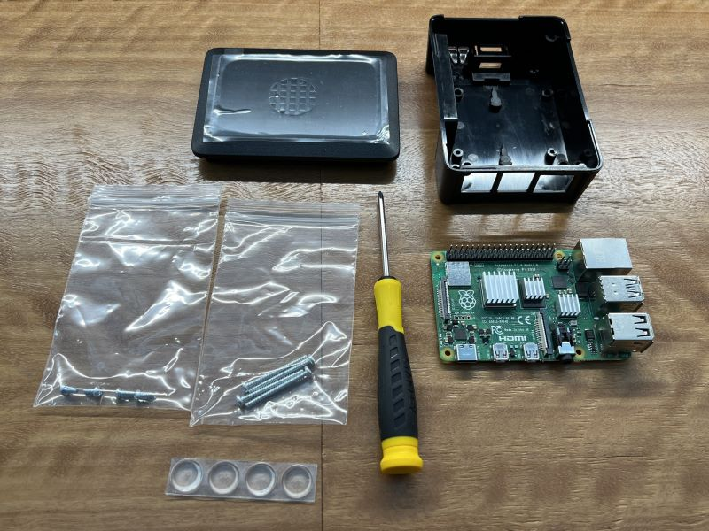
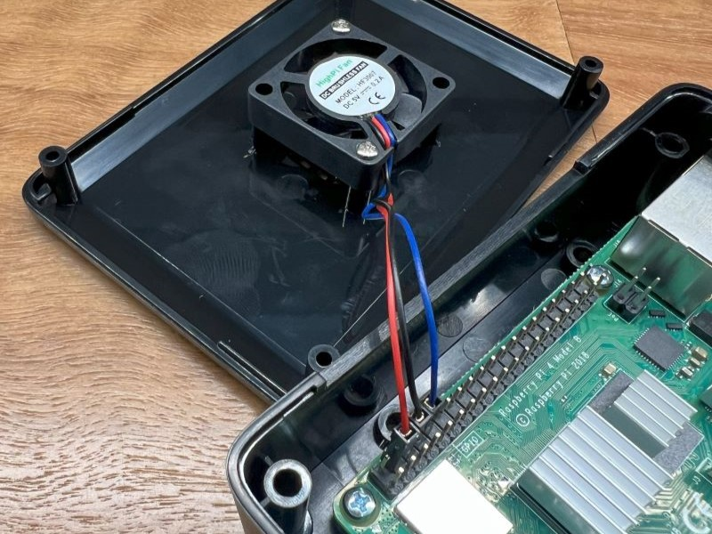
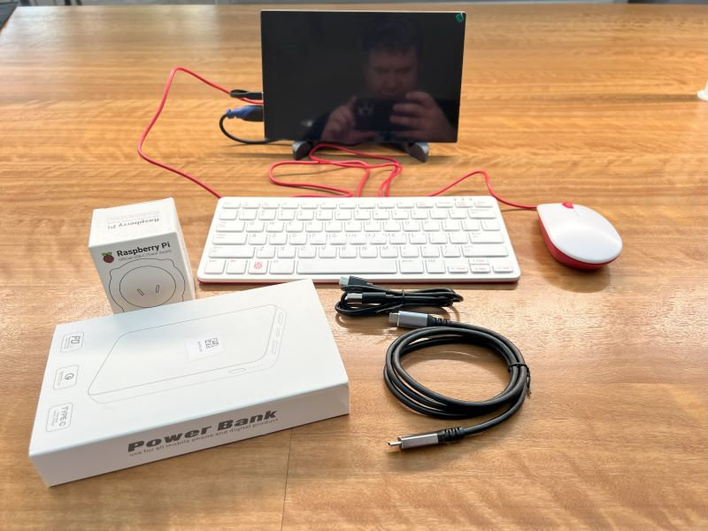
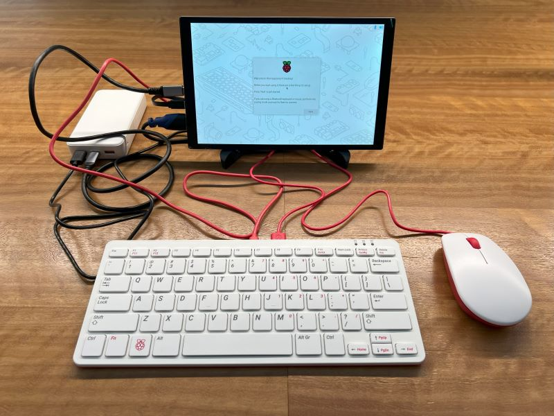

Building programs really requires that you have access to a computer that you can play around with. To maximise your experience, we have designed things to work with a [Raspberry Pi](https://www.raspberrypi.com) single board computer.

Using the multi-tool will give you several advantages:

- You can play around with unix without risking your day-to-day computer (which you can switch to Linux once you are more confident)
- The Raspberry Pi include pins for **General Purpose Input / Output** (**GPIO**) though a [40-pin header](https://www.raspberrypi.com/documentation/computers/raspberry-pi.html#gpio-and-the-40-pin-header) on the board. We can use this to interact with electronics and see how we can control things in the real world using code.
- Playing with a Raspberry Pi is just more fun 😁.

*Where do you get one of these multi-tools?*

You don't. You *build it yourself*.

The next couple of pages will go over how to build and configure the multi-tool. You can then use this for the activities in this guide. We will first look at the hardware you need, and where you can get it, and then we can look at the software you need and how you can install that using the [Terminal](../../1-concepts/01-terminal) on your Pi.

Let's get going...

## Alternatives

Not sure if you want the hardware, but still want to set something like this up? There are some alternatives.

Rather than getting a new physical machine, you can download virtual machine software and follow the software setup to get it working in there.

## Hardware

There are many hardware and component choices you can make building your Raspberry Pi multi-tool. Our selection is a self-contained unit using off-the-shelf parts that can run off a battery. Depending on your needs, you may forgo some choices, like the battery or the display.

### Get the components

This is the list of components we used to build our multi-tool with links to Australian retailers where they can be purchased.

- 1 x [Raspberry Pi 4 Model B 8GB](https://core-electronics.com.au/raspberry-pi-4-model-b-8gb.html)
- 1 x [Raspberry Pi 4 Power Supply (Official) - USB-C 5.1V 15.3W (White)](https://core-electronics.com.au/raspberry-pi-4-official-power-supply-usb-c-5v-15w-white.html)
- 1 x [MicroSD Memory Card - 32GB Class 10](https://core-electronics.com.au/microsd-memory-card-32gb-class-10.html)
- 1 x [Pi Hut Modular Raspberry Pi 4 Case - Black](https://core-electronics.com.au/pi-hut-modular-raspberry-pi-4-case-black.html)
- 1 x [3pc Heatsink Kit for Raspberry Pi 4](https://core-electronics.com.au/3pc-heatsink-kit-for-raspberry-pi-4.html)
- 1 x [HighPi Pro 5V Cooling Fan](https://core-electronics.com.au/highpi-pro-5v-cooling-fan.html)
- 1 x [Raspberry Pi Keyboard - Red/White](https://core-electronics.com.au/raspberry-pi-keyboard-red-white.html)
- 1 x [Raspberry Pi Mouse - Red/White](https://core-electronics.com.au/raspberry-pi-mouse-red-white.html)
- 1 x [10.1inch Capacitive Touch Display](https://littlebirdelectronics.com.au/products/10-1inch-capacitive-touch-display-wide-color-gamut-1280x800-optical-bonding-toughened-glass-panel-hdmi-type-c-display-interface)
- 1 x [0.5m Micro-HDMI Cable (HDMI Type-A to Type-D)](https://www.cablechick.com.au/cables/05m-micro-hdmi-cable-hdmi-type-a-to-type-d.html)
- 1 x [USB Type-C Short Sync & Charge Flat Cable 20cm](https://core-electronics.com.au/usb-type-c-short-sync-charge-flat-cable-20cm.html)
- 1 x [ModMyPi Modular RPi 2 Case - VESA Splash (75/100mm)](https://core-electronics.com.au/modmypi-modular-rpi-2-case-vesa-splash-75-100mm.html)
- 1 x [USB C Power Delivery Battery Bank 20000mAh](https://core-electronics.com.au/usb-c-pd-battery-bank-20000mah.html)

### Building your multi-tool

:::tip
Using your own SD card? Make sure you have installed Raspberry Pi OS on it. You can find the instructions in the [Set up my Raspberry Pi](/book/part-0-getting-started/2-computer-use/2-put-together/1-2-setup-pi/) section.
If we have provided you with an SD card, it will already have the OS installed.
::: 

Check you have all the components listed above.

Locate the Raspberry Pi and 3 piece heatsink kit. Remove the Pi from its packaging.

Peal the backing off the heatsinks and stick them to the Pi. The largest heatsink goes on the CPU(SOC), the two smaller ones go on the RAM and USB chips.

Find the case remove the screws and feet. You will need a screwdriver for this part.

:::Tip[Install the Pi in the case.]
This case is a bit fiddly to get the pi in correctly, but it doesn't require much force.

- Place the Pi in the case
- Align the network port with the opening.
- Apply a little pressure to the back of the USB ports, the headphone jack should slide into place.
- Push the board across so the USB-C power and Mini HDMI ports are seated correctly.
- All 4 Pi screws should line up with the holes in the case.

:::

Using the four short screws secure the Pi into the case.

Locate the fan and  Peel the plastic protective layer off the top of the case.

Place the fan on the case mounts with the label facing up and use two of the screws to secure it in place.
:::note
Facing the label up will ensure the fan blows air into the case.
Only two screws are required to secure the fan. The other two and nuts are not required.
Ensure the fan cable is close to one of the long sides.

:::

Connect the fan to the GPIO pins on the Pi. (See image at top of this document for pin locations)

- Red wire to pin 4 (5V)
- Black wire to pin 6 (Ground)
- Blue wire to pin 8 (GPIO14)

Place the lid on the case, Locate the VESA mount and nylon screws/spaces.

Peel the protective layer off the VESA mount.

Secure the VESA mount to the case using the four long screws, this also attaches the lid.
:::danger[Make sure the 75 x 75mm VESA mount holes are on opposite to the USB-C and Mini HDMI ports.]
:::

Install the Micro SD card into the Raspberry Pi.

- Remove the Micro SD card form the SD card adapter.
- Position the Pi with the VESA mount on top.
- Insert the SD card into the Pi with the label facing up.

### Connecting Accessories

Locate the Screen Box, remove the screen and cables.

:::danger[Make sure the SD card is installed before connecting the screen, or you will need to remove the screen to install it.]
:::
Attach the Raspberry Pi to the screen.

- Face the top of the screen towards yourself
- Place two of the spacers on the VESA mount holes on the screen closets to the top.
- Place the Pi on top of the spacers.
- Place the other spaces on the nylon screws
- Secure the Pi to the screen using the two nylon screws and four spacers. Use your fingers to tighten the screws.

Locate the Micro HDMI to HDMI and USB-C to USB-A cable 20cm cables.

Connect the USB-C to the Screens Display and Touch port and the USB-A to side to the Pi.
Connect the Micro HDMI to the Pi's First HDMI port and Full size HDMI to the screen.
:::tip[Make sure the Micro HDMI is connected to the first port as pictured]
Using the second HDMI port may cause sound issues.

Putting a loop in the cable will help with cable management.
:::

Remove the stand from it's packaging and bend into shape.

Place the screen on the stand, it can be a challenging to get the screen to sit correctly.

Locate the keyboard and mouse.

Plug the mouse into the keyboard and connect the micro USB to the keyboard and the USB-A to the Pi. Use the USB 2.0 ports (black ports)

### Powering the Multi-tool

There are several configurations you can use to power the multi-tool.

#### Option A - Mains Power

The easiest way to power the multi-tool is to use the power supply that came with the Pi. Connect the USB-C end to the Pi and the other end to a power outlet.
:::tip
Fold the screen down to plug in the power supply.
:::

#### Option B - Battery Power

If you are on the go or want to use the multi-tool in a location without power, you can use a battery bank. Using the USB-C to USB-A cable, connect the USB-A end to the battery bank and the USB-C end to the Pi. The battery bank will turn on automatically.

:::note
For intense workloads you may need to connect the display directly to the battery bank rather than via the Pi.

This can be done eitehr with the supplied USB-C to USB-C cable or using the 20Cm USB-C to USB-A cable. (Note that will disable the touch functionality of the screen).

USB-C to USB-C cable

USB-C to USB-A cable (20cm)

:::

### Tidying up

Just to make things a bit neater use cable ties to secure the cables.

### Complete Setup

You should now have a fully constructed Raspberry Pi multi-tool. To continue the setup process, see [Set up my Raspberry Pi](/book/part-0-getting-started/2-computer-use/2-put-together/1-2-setup-pi/) for instructions on how to install the operating system and configure the Pi.

