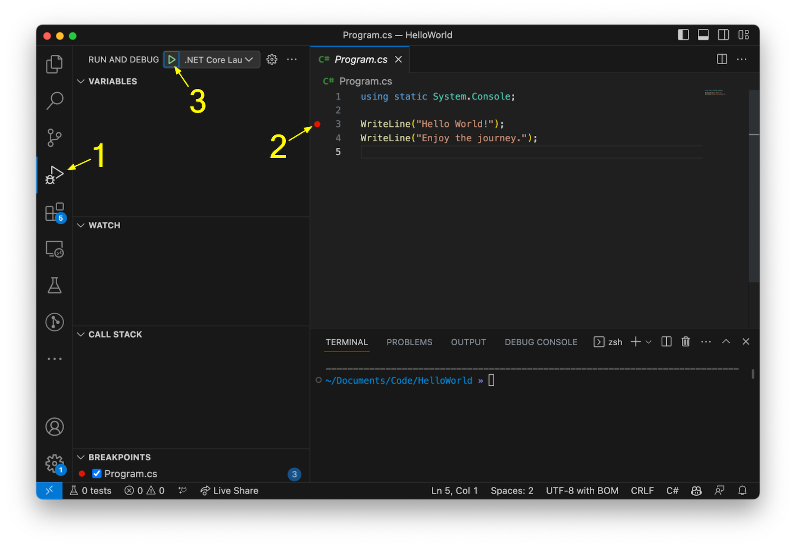
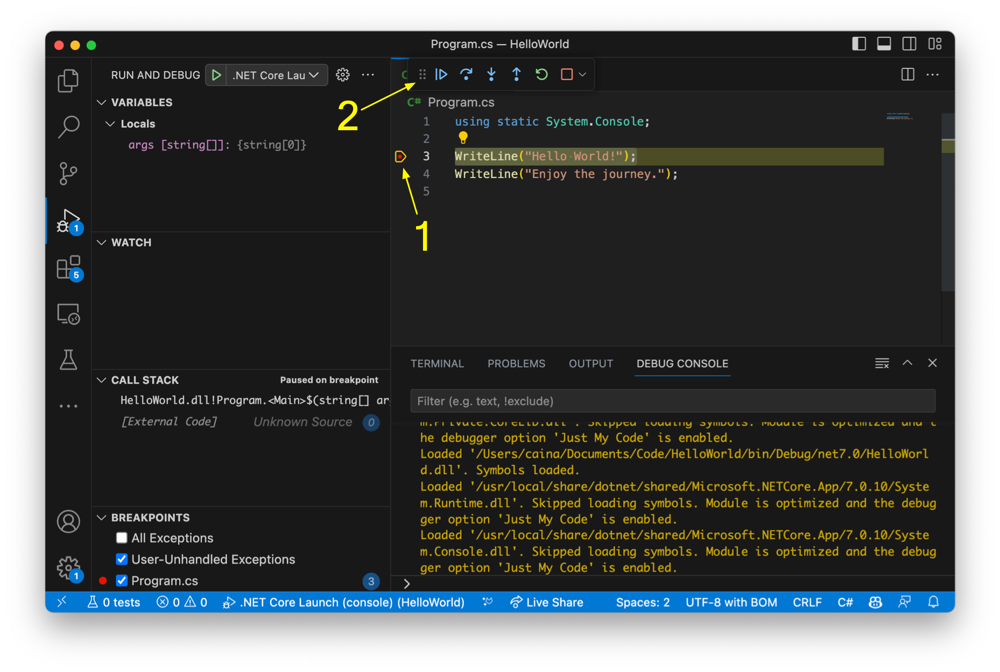

There have always been challenges in getting computers to do what we want. At one stage, computers were large electrical devices filling rooms. During early work on these computers, a moth was found stuck in a relay and Admiral Grace Hopper coined the term [debugging](https://en.wikipedia.org/wiki/Debugging) as the process of fixing this issue. The term has stuck, and issues in our programs are known as **bugs** and we still use **debugging** to describe the process of finding and removing them.

Programming languages include tools to aid developers in understanding what is happening as the program runs.
These tools will be great aids to you as you try to learn about how instructions work within your program.
One of the most important tools we will use is the **debugger**.
At this point in our journey, we can use the debugger to step through our program line by line.

<!-- **TODO: 1 - Highlight debugger link in sidebar, 2 - breakpoint, 3 - play button** -->

The image above shows the debugger selected in vscode, with a breakpoint on line 3. The key features are:

1. This link in the sidebar allows you to **access the debugger**.
2. Clicking in the area to the left of the line numbers will **set a breakpoint** on that line. When you add a breakpoint a red dot is added to the left-hand side of the line. The debugger will then **break** (stop) execution at that point and give control to you.
3. The **play button** gets vscode to run the command line tools needed to start this, and for it to hook up to the debugging process.

Make sure you have at least two lines of code, then try launching the debugger. You should see several commands run in the terminal area, and then the window will switch to the **Debug Console** tab. The program will stop and you will see a new set of control buttons appear, as shown below.

<!-- **TODO: Highlight the things below in the image above** -->

1. The yellow marker around the breakpoint indicates the current line of code running.
2. A new control panel has appeared at the top of the screen with buttons to control execution.

This control panel gives you the power to step through the program as it runs.

* The first play button will **continue** the execution, only stopping again if another breakpoint is encountered.
* The second button will **step-over** the current line and move to the next line shown.
* The next two buttons are **step-into** and **step-out**, both of which we will explore in [Part 2](../../../../part-2-organised-code/00-part-2-programs-as-organised-code/).
* The fifth button is used to **restart** the program.
* Finally, the last button will **stop** the program.

Give it a try!
Click **stop**, and add another line of code to your program so it matches the screenshot above.
Notice that this doesn't affect the breakpoint you made.

Click the play button to start the debugger again and wait for it to stop at line 3.
In the control bar, click the **step-over** button to run line 3 and go to line 4. Switch the tab at the bottom to the terminal to see the "Hello World!" message written. Press **step-over** again, and line 4 will run, the next message will appear, and the program will stop as this was the last instruction.

:::Note
Debuggers are great for locating complicated issues and helping you see how a program is running.
As you progress, you will get better and better at using it to explore and troubleshoot the code you write.
:::
