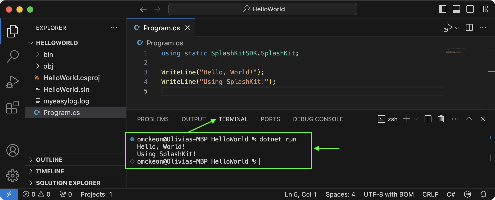
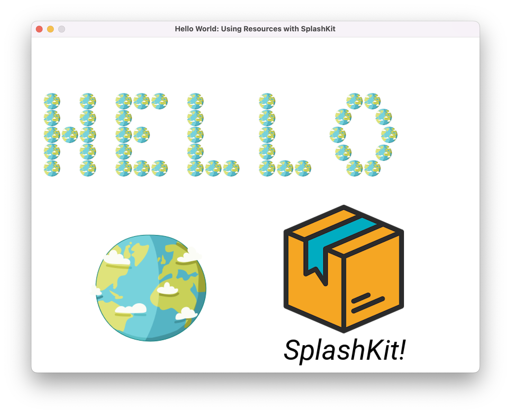

Continuing on from [the previous page](./1-hello-world-cli.md), we will now be using *SplashKit* to create a GUI (**G**raphical **U**ser **I**nterface) Hello World program.

## Add SplashKit package to project

To install the *SplashKit NuGet package* in your project, copy and paste the following command into your Terminal window:

```bash
dotnet add package SplashKit
```

:::note
After running the command above, your `HelloWorld.csproj` file will have been updated to look like this:


:::

Now we can use all the SplashKit functionality in our program &#128526;

## Terminal Hello World *with SplashKit!*

Here we will recreate the *terminal Hello World* program that we did on the previous page, but **using SplashKit** this time!

In your Program.cs file, you can replace the first line with the follow code:

```cs
using static SplashKitSDK.SplashKit;
```

Then run your program again using `dotnet run`.

:::tip[For Example]
Using the following code:

```cs
using static SplashKitSDK.SplashKit;

WriteLine("Hello, World!");
WriteLine("Using SplashKit!");
```

We would get this output in the Terminal (shown in the Green Box):


:::

:::caution['dotnet run' not working?]
If you were not able to install SplashKit globally in the installation guide in the [previous chapter](../../2-computer-use/2-put-together/0-0-overview.md), you can use the following command instead:

```bash
skm dotnet run
```

You will need to add `skm` to the front of the commands mentioned in the Concepts [Build and Run](../1-concepts/03-build-and-run.md) page until you are able to get SplashKit installed globally (by [troubleshooting](../../2-computer-use/2-put-together/0-1-troubleshooting-install.md), or asking one of the tutors for help).
:::

## Graphical Hello World

We are getting to the fun part now!

Using a Graphical User Interface for your program will allow you to create more versatile programs much more easily. And it's fun to see your code come to life with these graphics!

### Using Basic Shapes/Text

Here we will be using SplashKit functionality to draw some shapes on the Window that will open when the program is run.

:::note
You're not expected to understand how the following code works at this point. It has been created for fun, so you can just copy and paste - and enjoy a colourful "Hello World!" GUI program!
:::

Copy the following code and paste it into your Program.cs file (replacing existing code) and then run your program using `dotnet run`:

```cs
using static SplashKitSDK.SplashKit;

OpenWindow("My First GUI Program", 640, 480);

ClearScreen(ColorWhite());
DrawText("Hello World! - using SplashKit shapes:", ColorBlack(), 50, 50);

// H
FillRectangle(ColorRed(), 50, 100, 20, 100);
FillRectangle(ColorRed(), 70, 140, 40, 20);
FillRectangle(ColorRed(), 110, 100, 20, 100);

// E
FillRectangle(ColorOrange(), 150, 100, 20, 100);
FillRectangle(ColorOrange(), 170, 100, 40, 20);
FillRectangle(ColorOrange(), 170, 140, 20, 20);
FillRectangle(ColorOrange(), 170, 180, 40, 20);

// L
FillRectangle(ColorGold(), 230, 100, 20, 100);
FillRectangle(ColorGold(), 250, 180, 40, 20);

// L
FillRectangle(ColorGreenYellow(), 310, 100, 20, 100);
FillRectangle(ColorGreenYellow(), 330, 180, 40, 20);

// O
FillEllipse(ColorLimeGreen(), 390, 100, 80, 100);
FillEllipse(ColorWhite(), 410, 120, 40, 60);

// W
FillTriangle(ColorGreen(), 50, 250, 90, 370, 120, 250);
FillTriangle(ColorGreen(), 90, 250, 120, 370, 160, 250);
FillTriangle(ColorWhite(), 70, 250, 90, 310, 110, 250);
FillTriangle(ColorWhite(), 100, 250, 120, 310, 140, 250);
FillRectangle(ColorWhite(), 70, 350, 80, 30);

// O
FillEllipse(ColorBlue(), 170, 250, 80, 100);
FillEllipse(ColorWhite(), 190, 270, 40, 60);

// R
FillTriangle(ColorBlueViolet(), 270, 250, 270, 350, 340, 350);
FillTriangle(ColorWhite(), 252, 250, 252, 350, 320, 350);
FillEllipse(ColorBlueViolet(), 252, 250, 80, 60);
FillEllipse(ColorWhite(), 270, 270, 40, 20);
FillRectangle(ColorWhite(), 252, 250, 20, 100);
FillRectangle(ColorBlueViolet(), 270, 250, 20, 100);

// L
FillRectangle(ColorPurple(), 360, 250, 20, 100);
FillRectangle(ColorPurple(), 380, 330, 40, 20);

// D
FillEllipse(ColorMagenta(), 420, 250, 100, 100);
FillEllipse(ColorWhite(), 440, 270, 60, 60);
FillRectangle(ColorWhite(), 420, 250, 30, 100);
FillRectangle(ColorMagenta(), 450, 250, 20, 101);

// !
FillRectangle(ColorPink(), 550, 250, 20, 60);
FillCircle(ColorPink(), 560, 340, 10);

RefreshScreen();
Delay(5000);
```

Here is what the code above will create:


Yes... The program above was created using just 3 shapes - Rectangles, Ellipses, and Triangles! (Well... 4 if you count the last little Circle on the exclamation mark)

### Using Images, Fonts and SoundEffects

The code for this part will be using SplashKit functionality to draw images, play sound effects and draw text with a specific font.

:::note[Reminder]
You're not expected to understand how the following code works at this point. It has been created for fun, so you can just copy and paste - and enjoy another "Hello World!" GUI program!
:::

Copy the following code and paste it into your Program.cs file (replacing existing code) and then run your program using `dotnet run`:

```cs
using static SplashKitSDK.SplashKit;

// download resources
DownloadSoundEffect("Hello World", "https://github.com/splashkit/the-programmers-field-guide/raw/main/public/resources/code-examples/part-0/hello-world-snippet-saddle-club.ogg", 443);
DownloadFont("main", "https://github.com/splashkit/the-programmers-field-guide/raw/main/public/resources/code-examples/part-0/Roboto-Italic.ttf", 443);
DownloadBitmap("Earth", "https://github.com/splashkit/the-programmers-field-guide/raw/main/public/resources/code-examples/part-0/earth.png", 443);
DownloadBitmap("SmallEarth", "https://github.com/splashkit/the-programmers-field-guide/raw/main/public/resources/code-examples/part-0/earth-small.png", 443);
DownloadBitmap("SplashKitBox", "https://github.com/splashkit/the-programmers-field-guide/raw/main/public/resources/code-examples/part-0/skbox.png", 443);

OpenWindow("Hello World: Using Resources with SplashKit", 800, 600);
PlaySoundEffect("Hello World");

ClearScreen(ColorWhite());
DrawText("Anyone remember the \"Hello World\" Saddle Club song?", ColorBlack(), "main", 30, 40, 200);
RefreshScreen();
Delay(2500);

ClearScreen(ColorWhite());

// H
DrawBitmap("SmallEarth", 20, 100);
DrawBitmap("SmallEarth", 20, 130);
DrawBitmap("SmallEarth", 20, 160);
DrawBitmap("SmallEarth", 20, 190);
DrawBitmap("SmallEarth", 20, 220);
DrawBitmap("SmallEarth", 52, 160);
DrawBitmap("SmallEarth", 84, 100);
DrawBitmap("SmallEarth", 84, 130);
DrawBitmap("SmallEarth", 84, 160);
DrawBitmap("SmallEarth", 84, 190);
DrawBitmap("SmallEarth", 84, 220);
RefreshScreen();
Delay(200);

// E
DrawBitmap("SmallEarth", 148, 100);
DrawBitmap("SmallEarth", 148, 130);
DrawBitmap("SmallEarth", 148, 160);
DrawBitmap("SmallEarth", 148, 190);
DrawBitmap("SmallEarth", 148, 220);
DrawBitmap("SmallEarth", 180, 100);
DrawBitmap("SmallEarth", 212, 100);
DrawBitmap("SmallEarth", 180, 160);
DrawBitmap("SmallEarth", 180, 220);
DrawBitmap("SmallEarth", 212, 220);
RefreshScreen();
Delay(200);

// L
DrawBitmap("SmallEarth", 276, 100);
DrawBitmap("SmallEarth", 276, 130);
DrawBitmap("SmallEarth", 276, 160);
DrawBitmap("SmallEarth", 276, 190);
DrawBitmap("SmallEarth", 276, 220);
DrawBitmap("SmallEarth", 308, 220);
DrawBitmap("SmallEarth", 340, 220);
RefreshScreen();
Delay(200);

// L
DrawBitmap("SmallEarth", 404, 100);
DrawBitmap("SmallEarth", 404, 130);
DrawBitmap("SmallEarth", 404, 160);
DrawBitmap("SmallEarth", 404, 190);
DrawBitmap("SmallEarth", 404, 220);
DrawBitmap("SmallEarth", 436, 220);
DrawBitmap("SmallEarth", 468, 220);
RefreshScreen();
Delay(200);

// O
DrawBitmap("SmallEarth", 530, 160);
DrawBitmap("SmallEarth", 622, 160);
DrawBitmap("SmallEarth", 540, 128);
DrawBitmap("SmallEarth", 560, 100);
DrawBitmap("SmallEarth", 592, 100);
DrawBitmap("SmallEarth", 612, 128);
DrawBitmap("SmallEarth", 540, 192);
DrawBitmap("SmallEarth", 560, 220);
DrawBitmap("SmallEarth", 592, 220);
DrawBitmap("SmallEarth", 612, 192);
RefreshScreen();
Delay(500);

// World
DrawBitmap("Earth", 100, 350);
RefreshScreen(60);
Delay(2000);

// SplashKit ("Me")
DrawBitmap("SplashKitBox", 450, 300);
DrawText("SplashKit!", ColorBlack(), "main", 50, 450, 530);
RefreshScreen(60);
Delay(2000);
```

Following a bit of a theme with *writing words out of something other than actual text*, we get this as the final screen:



&#127759; Yes, that is "HELLO", written using "worlds" &#128516;  
(Because "HELLO" ... "*world*")

:::tip[Hooray!]
You have now successfully run terminal and graphical programs in C#!

Next we will have a look at the Debugger, to help you when things don't run quite so smoothly.
:::
