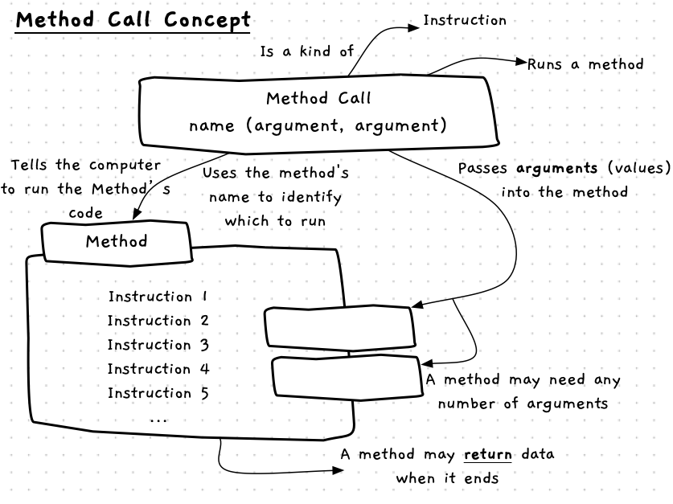

A method call is an instruction that gets the computer to run the code in a [method](../03-method). You use the name of the method to identify which you want to run. Some methods require data, which you must **pass** as **arguments** to the method as part of the method call.

[Figure 5.3](#FigureMethodCall) shows the concepts related to the method call.

<a id="FigureMethodCall"></a>


<div class="caption"><span class="caption-figure-nbr">Figure 5.3: </span>A method calls runs a method, passing in values for the method to use</div><br/>

## Method Call - why, when, and how

[Methods](../03-method) are building blocks that contain instructions that do a task - sort of like mini-programs. A large part of your code will be calling methods to get them to do the things.

When you are thinking about calling a method you need to picture the method, see what it does, know what you need to give it for it to do its job, and what it will give you back. To make the call, you use the name of the method followed by a list of the data the method needs to do its job.

:::tip[Method Call]

- Know what the method does
- Know what you need to give it
- Know what it gives you back

:::

## In C#

A method call allows you to run the code in a [Method](../03-method), getting its instructions to run before control returns to the point where the method was called.

:::tip[Syntax]
[Figure 5.4](#FigureMethodCallSyntax) shows the syntax of a method call.

- A method call consists of a method name followed by an opening parenthesis, followed by zero or more arguments (delimited by commas), followed by a closing parenthesis.

<a id="FigureMethodCallSyntax"></a>


<div class="caption"><span class="caption-figure-nbr">Figure 5.4: </span>The syntax of a method call</div><br/>
:::


## Examples 

The code in [Listing 5.6](#ListingMethodCalls) contains a C# program with four method calls. Each method call runs the `WriteLine` method to output text to the Terminal.

The method call starts with the method’s name that indicates the method to be called: `WriteLine`.

Following the identifier is a list of values within parenthesis (called **arguments**), these are the values that are passed to the method for it to use.

:::caution

C# is case sensitive so using `writeLine` instead of `WriteLine` will not work.

:::

<a id="ListingMethodCalls"></a>

```csharp
using static System.Console;

WriteLine("Count back from 2...");
WriteLine(2);
WriteLine(1);
WriteLine(0);
```

<div class="caption"><span class="caption-figure-nbr">Listing 5.6: </span>Method calls within a C# program</div>

The following code uses three different methods from the [SplashKit](https://splashkit.io) library.

- [DownloadSoundEffect](https://splashkit.io/api/networking/#download-sound-effect) will access a sound effect from the internet and load it into your program to use. It requires three parameters, the name to refer to the sound effect when you play it, the URL to download from, and the port for the network communication (443 for https or 80 for http).
- [PlaySoundEffect](https://splashkit.io/api/audio/#play-sound-effect-named) will play a loaded sound effect. You pass it the name of the sound effect you loaded.
- [Delay](https://splashkit.io/api/utilities/#delay) causes the program to wait. You pass this the number of milliseconds to wait - 5000 being 5 seconds in this example.

<a id="ListingDrawShapes"></a>

```csharp
using static SplashKitSDK.SplashKit;

DownloadSoundEffect("hello", "https://programmers.guide/hello.wav", 443);
PlaySoundEffect("hello");
Delay(5000);
```

<div class="caption"><span class="caption-figure-nbr">Listing 5.x: </span>Playing a sound effect</div>

:::note[Summary]

- A method call is an **instruction** that commands the computer to run the code in a method.
- Use the name to identify the [Method](../03-method) to run.
- Data values passed to the method are called **arguments**. These are put between parentheses after the method name.
- When the method’s task is complete the program continues with the next instruction after the method call.

:::
