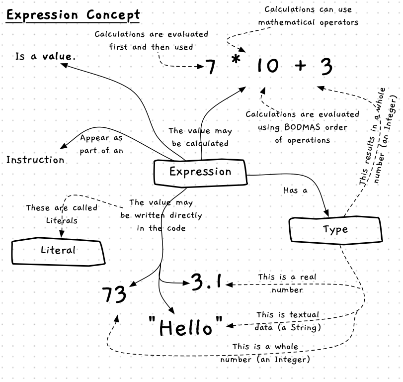

Some instructions need data, this data can be calculated or provided as a literal value in the code. The term **expression** is used in programming to describe the places in the code where data must be supplied. At run time each expression becomes a value that is used by the instruction.

The concepts related to expressions are shown in [Figure 5.6](#FigureExpression).

<a id="FigureExpression"></a>


<div class="caption"><span class="caption-figure-nbr">Figure 5.6: </span> An expression provides a <strong>value</strong> to be used in an instruction.</div><br/>

## Expressions - why, when, and how

Instructions need data, and anywhere that occurs the language will use an expression. This lets you put whatever data you want in that instruction. This data can be hard-coded as a [literal](../06-literal), use [variables](../12-variable), and contain mathematical operators to calculate the value to use.

When you code an expression, you need to think about the value you need and how you can get it. You could provide a fixed value using a literal, read a value stored in a variable, or combine values with standard mathematical operators.

## In C#

An expression in C# can be used to calculate a value needed by an instruction. Each expression will have a [Type](../06-type), and can contain mathematic operators.

[Table 5.1](#TableOperators) lists the operators that you can include in your expressions, listed in order of precedence<sup>[1](#FootnotePrecedence)</sup>. The operators you can use depend on the kind of data that you are using within the expression.

<a id="TableOperators"></a>
  |  Operator | Description                          | Example
  ----------------|------------------------------------------|----------------
  |      ( )      | Parenthesis                              |  `(1 + 1) * 2`
  |     % * /     | Modulo<sup>[a](#FootnoteOperators)</sup>, Multiplication and Division |  `1 / 2 * 5 % 3` 
  |      + -      | Addition and subtraction                 |  `10 + 3 - 4`

<hr class="footnote">
<div id="FootnoteOperators" class="footnote">
<sup>a </sup>The remainder after division. For example, 9 modulo 3 is 0, 10 modulo 3 is 1, 11 modulo 3 is 2, 12 modulo 3 is 0 and so on.
</div>
<div class="caption"><span class="caption-figure-nbr">Table 5.1: </span> C# Operators and Example Expressions</div><br/>

## Examples

[Table 5.2](#TableExpressions) shows some example expressions, their values, and types. Expressions can be literal values, entered in the code. An Expression can also contain mathematical calculations using standard addition, subtraction, multiplication, division, and groupings.

<a id="TableExpressions"></a>
  |    Example Expression   |      Value       |   Type
  ------------------------------|--------------------- |---------------
  |             73              |         73           |  int
  |            2.1              |         2.1          |  double
  |       "Hello World"         |   \"Hello World\"    |  string
  |           "Fred"            |      \"Fred\"        |  string
  |           3 * 2             |          6           |  int
  |         1 + 3 * 2           |          7           |  int
  |         (1 + 3) * 2         |          8           |  int
  |         7 - 3 + 1           |          5           |  int
  |           3 / 2             |       1<sup>[b](#FootnoteExpressions)</sup>  |  int
  |          3.0 / 2.0          |         1.5          |  double
  |            3 % 2            |          1           |  int
  |           11 % 3            |          2           |  int
  |          3 / 2.0            |      1.5<sup>[c](#FootnoteExpressions)</sup> |  double
  | 1 + (3 / 2.0) + 6 * 2 - 8   |         6.5          |  double
<hr class="footnote">
<div id="FootnoteExpressions" class="footnote">
<sup>b </sup>C# does integer division for int values, rounding the value down.<br/>
<sup>c </sup>If either, or both, values are real (floating point) numbers the result is also a real number
</div>
<div class="caption"><span class="caption-figure-nbr">Table 5.2: </span>Example C# Expressions and their values</div><br/>

## Activities

Which of the following statements are expressions? Assume `x` is a variable that contains the integer value 9. (Line numbers are for reference only).

```csharp
1. x + 12;
2. (x + 12);
3. x + "Hello World";
4. int y;
5. x + 3 * 2
6. (x + 3) * 2
```

<div class="caption"><span class="caption-figure-nbr">Listing 5.7: </span>Identify the expressions</div>
<details>
  <summary role="button">Answer</summary>
  <ul>
    <li><strong>Line 1:</strong> Yes this is an expression because it performs the calculation 9 + 12 and evaluates to the integer 21.</li>
    <li><strong>Line 2:</strong> Yes this is an expression because it performs the calculation 9 + 12 and evaluates to the integer 21. The brackets can be ignored as they simply group the expression before the evaluation takes place</li>
    <li><strong>Line 3:</strong> This is tricky. C# includes some *intelligence* that means this is an expression because the compiler will convert the integer to a string and evaluate the expression by concatenating the two strings "3" and "Hello World" to give "3Hello World"</li>
    <li><strong>Line 4:</strong> No, this is a variable declaraction. There are no expressions on this line.</li>
    <li><strong>Line 5:</strong> Yes this is an expression. It will be `9 + 3 * 2`, the multiplication goes first so this is `9 + 6`, being `15`.</li>
    <li><strong>Line 6:</strong> Yes this is an expression. Parenthesis mean the `(9 + 3)` is evaluated first, giving `12 * 2`, being `24`.</li>
  </ul>
</details>


:::note[Summary]

- An expression is a **term** given to code that calculates a value.
- An expression provides a **value** that is used in an instruction.
- The expression’s value may be calculated or entered directly into the code.
- Calculations can use mathematical operators: + for addition, - for subtraction, * for multiplication, / for division, and parenthesis ( ) for grouping.
- Expressions are evaluated using the BODMAS<sup>[d](#FootnoteBODMAS)</sup> order of operations.
- Values entered directly within an expression are **Literal** values.
<hr/>
<div id="FootnoteBODMAS" class="footnote"><sup>d</sup>BODMAS indicates that expressions are evaluated B brackets first, O orders (which includes powers and square roots), DM for division and multiplication (which are of equal precedence and are evaluated left-to-right), then AS addition and subtraction (of equal precedence, evaluated left-to-right).</div>

:::
