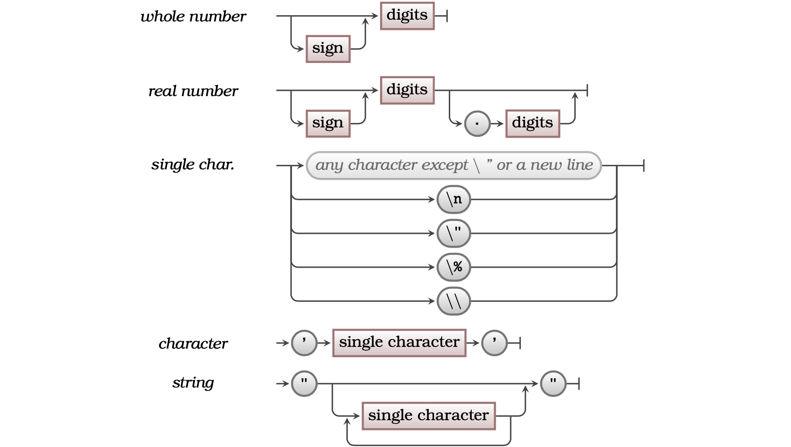

Programs are instructions and data, so we need a way to capture data within our code.

The most direct way of achieving this is to type the value you want within the code itself. This is called a **literal**, as the value you put in is *literally* used in the instruction.

A literal is either a **number value** or **text value** written directly in the code. A Literal is a whole, or part of, an [Expression](../04-expression) - the technical term for the values we place within the code.

[Figure 5.7](#FigureLiteral) shows the concepts relate to Literals.

<a id="FigureLiteral"></a>


<div class="caption"><span class="caption-figure-nbr">Figure 5.7: </span>Concepts related to Literals.</div><br/>

## In C#

[Figure 5.8](#FigureLiteralSyntax) shows the syntax for the different literal values you can enter into your C# code. Most of these are self-evident, so do not worry overly about studying the syntax in detail.

- **Numbers** - you enter as the value. For example, a whole number can be `127`, `-8711`, or `+10`. You can also have real numbers, which you write as `3.1415` for example.
- **Text** - You type within double quotes, or single quotes if you are after a single character. Within these, the `∖` character is used to indicate that the next character has a special meaning. We call this '*escaping*' a character. The following list includes the most useful special characters in C#:
  - `\n` creates a new line
  - `\"` creates a double quote character
  - `\\` creates a `\` character

:::tip[Syntax]

- A literal can be a whole number, real number, single escaped character, normal character or a string.
- A whole number consists of an optional sign, followed by one or more digits.
- Text consists of an opening double quote, followed by any number of optional characters, followed by a closing double quote

<a id="FigureLiteralSyntax"></a>


<div class="caption"><span class="caption-figure-nbr">Figure 5.8: </span>The syntax of a literal</div><br/>

:::


## Activities

Which of the following lines contain literals, and if so, identify them and describe their type (Line numbers are for reference only).

```csharp
1.  19
2.  "19"
3.  9a
4.  WriteLine("Hello World");
5.  "\\n"
6.  'c'
7.  'character'
8.  10 15
9.  '\\'
10. '\'
```

<div class="caption"><span class="caption-figure-nbr">Listing 5.8: </span>Identify the literals</div>
<details>
  <summary role="button">Answer</summary>
  <ul>
    <li><strong>Line 1: </strong>This is the literal number 19</li>
    <li><strong>Line 2: </strong>This is the literal string "19"</li>
    <li><strong>Line 3: </strong>This is not a literal. It is malformed because it is neither character, string or number.</li>
    <li><strong>Line 4: </strong>This expression contains the string literal "Hello World"</li>
    <li><strong>Line 5: </strong>This is a string that contains the backslash-escaped literal character for a newline</li>
    <li><strong>Line 6: </strong>This is the literal character 'c'</li>
    <li><strong>Line 7: </strong>This is not a literal. It is malformed because it is neither a string nor a single character. It contains multiple characters inside opening and closing single quotes (which denote a single character).</li>
    <li><strong>Line 8: </strong>Both 10 and 15 are literal numbers, but as a whole, this is not a literal. It is malformed because of the space that separates these values. </li>
    <li><strong>Line 9: </strong>This is the literal character for a backslash '\'</li>
    <li><strong>Line 10: </strong>This is not a valid literal character. The \ needs to be followed by a valid escape character. In this case that is the `'`, and therefore we are missing a closing quote.</li>
  </ul>
</details>

:::note[Summary]

- A Literal is a number or text value entered directly into the program’s source code.
- A Literal can be part or all of an [Expression](../04-expression).
- These values are **hard-coded** into the program - meaning they do not change when it is run.
- The backslash character \ in C# is used to indicate that the character that directly follows it has a special meaning.

:::
