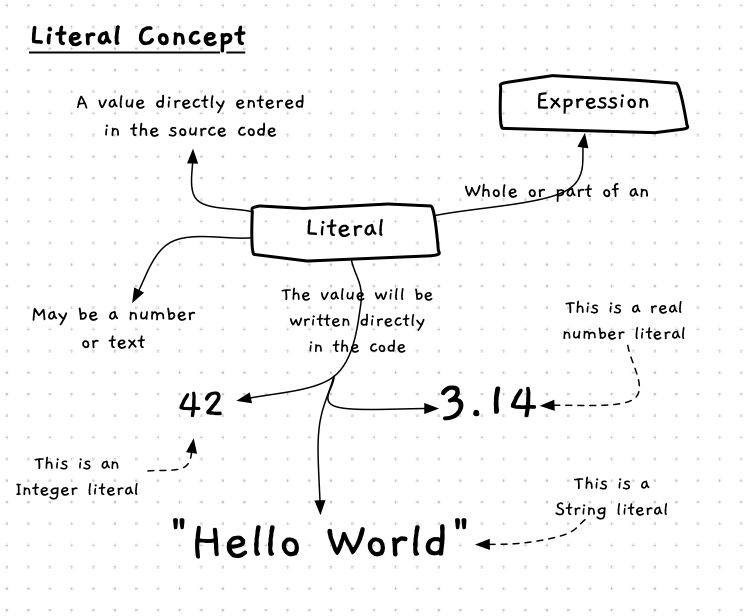

Programs are instructions and data, so we need a way to capture data within our code.

The most direct way of achieving this is to type the value you want within the code itself. This is called a **literal**, as the value you put in is *literally* used in the instruction.
This can be either a **number value** or **text value** written directly in the code, and can be a whole, or part of, an [expression](../04-expression).

The concept map below shows the concepts related to literals.

Concepts related to literals.
 

## Literals -- when, why, and how

Your instructions need data, and one way you can provide it is by literally typing data into the code itself. A literal on its own is a valid expression (though you may also want to look at using [constants](../07-variable/#constants) to make this clearer), but literals can also be combined with values from variables to help you calculate new values. Literals can also be used in expressions just with other literals if you want.

## In C#

Figure 5.8 shows the syntax for the different literal values you can enter into your C# code. Most of these are self-evident, so do not worry overly about studying the syntax in detail.

:::tip[Syntax]

The syntax of a literal
 

:::

Data falls into one of two categories:

1. **Numbers**: a number can have a sign, and can be whole or real. Whole numbers have no decimal places, and real numbers can have decimal places. For example, `127`, `-8711`, and `+10` are all whole numbers. An example of a real number is `3.1415` or `-2.78349`.
2. **Text**: text is anything typed within double quotes, and a character is a single alphanumeric value typed between single quotes. Within text data, you can use the `\` character to indicate that the next character has a special meaning. We call this '*escaping*' a character. The following list includes the most useful special characters in C#:
   * `\n` creates a new line
   * `\"` creates a double quote character
   * `\\` creates a `\` character

## Activities

For each of the follow, identify if the value listed or used in an instruction is a literal and, if so, whether the data is text or a number:

1. `19`
2. `"19"`
3. `9a`
4. `WriteLine("Hello World");`
5. `"\n"`
6. `'c'`
7. `'character'`
8. `10 15`
9. `'\\'`
10. `'\'`

  
Answers

  <ul>
    <li><strong>1: </strong>This is the literal number 19.</li>
    <li><strong>2: </strong>This is the literal text "19".</li>
    <li><strong>3: </strong>This is not a literal. It is malformed because it is neither character, text, or number.</li>
    <li><strong>4: </strong>This instruction contains the literal text "Hello World".</li>
    <li><strong>5: </strong>This is literal text containing the escaped character for a new line.</li>
    <li><strong>6: </strong>This is the literal character 'c'.</li>
    <li><strong>7: </strong>This is not a literal. It is malformed because the single quotes denote a character, which should be a single alphanumeric value.</li>
    <li><strong>8: </strong>Both 10 and 15 are literal numbers, but as a whole this is not a literal. It is malformed because of the space that separates these values.</li>
    <li><strong>9: </strong>This is the literal character for a backslash '\'.</li>
    <li><strong>10: </strong>This is not a valid literal character. The `\` needs to be followed by a valid escape character. In this case, the computer will interpret the closing single quote as the character to escape, which means we are missing an actual closing quote.</li>
  </ul>

:::note[Summary]

* A literal is a number or text value entered directly into a program's source code.
* A literal can be part or all of an [expression](../04-expression).
* Literal values are **hard-coded** into a program, meaning they do not change when it is run.
* The backslash character `\` in C# is used to indicate that the character that directly follows it has a special meaning.

:::
