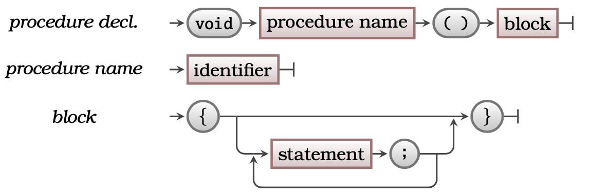

## Concept

Methods contain code that define the steps the computer performs when the method is called. In your Program you can define your own Methods, allowing you to divide a program's tasks into separate Methods.


<a id="FigureMethodDeclaration"></a>


<div class="caption"><span class="caption-figure-nbr">Figure 5.14: </span>Method Declaration</div><br/>

## In C#


:::tip[Syntax]

The syntax for a C# method declaration is shown in [Figure 5.15](#MethodDeclarationSyntax) below.

- A **Procedure Declaration** starts with the word *void*. This indicates that the following code is a procedure declaration to the compiler.
- The **Procedure Name** is an identifier. It is the name of the Procedure. This can be any valid [C# Identifier](../07-identifier) that has not been used before.
- The empty parenthesis must appear after the procedure’s name,and before the *block* <span class="review"> which contains the statements that make up the procedure itself.</span>.

<a id="MethodDeclarationSyntax"></a>


<div class="caption"><span class="caption-figure-nbr">Figure 5.15: </span>The syntax for method declarations</div><br/>

:::


## Examples

There are three Procedures declared in the code in [Listing 5.12](#ListingMethodDeclaration).

- The **block** of a procedure declaration should look familiar. This is the same as was used in the main function of the program to define its instructions, and is used for the same purpose within the Procedure Declaration.
- There are a number of conventions, called coding standards, that describe how your code should appear for a given language. In this text we will use a common C convention of having all *Method Names* in **lower case**, with underscores ( ) used to separate words. So the *Get Ingredients* procedure becomes `get_ingredients`.


<a id="ListingMethodDeclaration"></a>
```csharp
/*
 * Program: print_steps.cs
 * Prings out the steps to cook a meal... (partial)
 */

void find_what_to_cook() {
    printf("Step 1 - Find what to cook -\n");
    printf("1 - Find a recipe book\n");
    printf("2 - Pick recipe\n");
} 

void purchase_missing_ingredients() {
    printf("Step 2(a) - Purchase Missing Ingredients -\n");
    printf("1 - Goto Shop\n");
    printf("2 - Find ingredients and put in basket\n");
    printf("3 - Go to register and pay for ingredients in basket\n");
    printf("4 - Return home\n");
}
void get_ingredients() {
    printf("Step 2 - Purchase Ingredients -\n");
    printf("1 - Read recipe\n");
    printf("2 - Write a list of ingredients\n");
    printf("3 - Check food stocks, and tick off ingredients you already have\n");
    purchase_missing_ingredients();
}
int main() {
    find_what_to_cook();
    get_ingredients();
    // etc...
    return 0;
}

```
<div class="caption"><span class="caption-figure-nbr">Listing 5.12: </span>C# program for cooking a meal showing three method declarations</div>

## Activities

<span class="review">
1. Which of the following are valid C# method declarations, and why/why not?

```csharp
// [TODO]
```
<div class="caption"><span class="caption-figure-nbr">Listing 5.13: </span>Spot the valid C# method declarations</div>
<details class="review">
  <summary role="button">Answer</summary>
  <ul>
    <li><strong>Line 1: </strong> [TODO]</li>
  </ul>
</details>
</span>
<br>

:::note[Summary]

- A Method is an **artefact** that you can create and use in your code.
- Each Method contains code to perform a certain task. When you want the task
performed you call the Method.
- Methods should have a **side effect**<sup>a</sup>, meaning that it changes something when it
is executed.
- The Method’s declaration defines its **name**, and the **steps** it performs.
- Each instructions in the [Method](#method) is a [Statement](#statement).
- The Method’s [Identifier](#identifier):
  - Is the name used to call the Method.
  - Should be a **verb** that **reflects the task** the Method performs.
- When the Method is called its instructions are executed.
- Each Method’s instructions are isolated from the other code in your Program.
When you are working on a Method you do not need to know about the internal workings of the other methods.
<hr/>
<div id="FootnoteSideEffect" class="footnote"><sup>a</sup>Output to the Terminal is an example of a Side Effect. After calling these methods the text you wanted to appear was written to the Terminal. These Methods changed the Terminal.</div>

:::

## Further reading

- [C# Programming Guide - Methods](https://learn.microsoft.com/en-us/dotnet/csharp/programming-guide/classes-and-structs/methods)