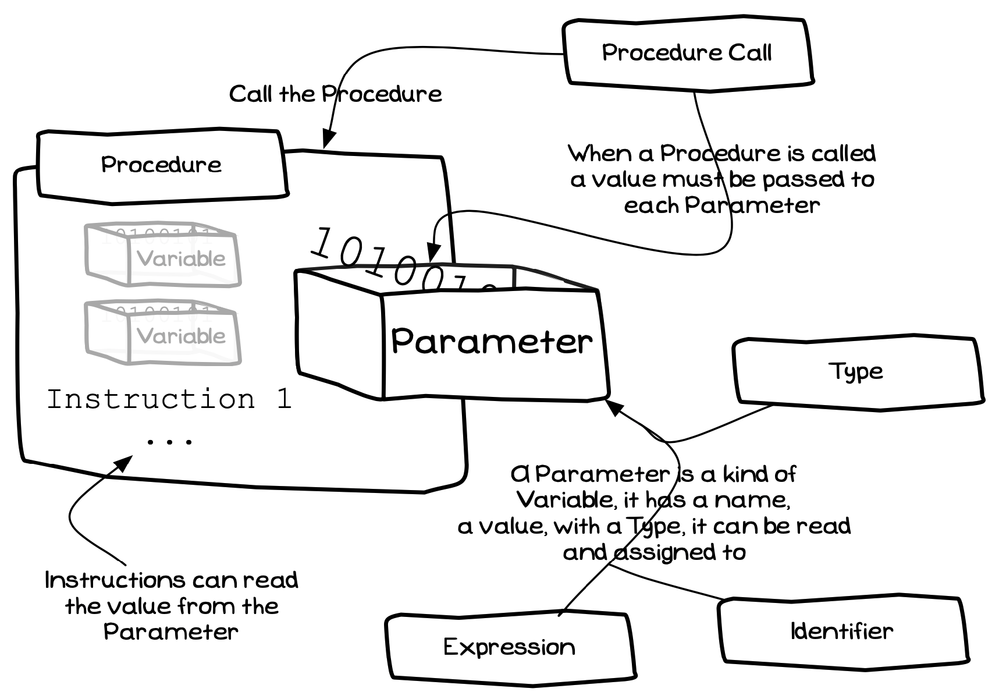

## Concept

The instructions within a Procedure define the actions that occur when that procedure is called. In most cases these instructions need to be given values to work with. These values can be passed to the Procedure using Parameters. The Parameter is a Variable that has its value set in the procedure call.

Figure 5.16:  Parameters allow data to be passed to Procedures
  

## In C#

[TODO]

## Examples

[TODO]

## Activities

[TODO]

:::note[Summary]

- Parameter is the **term** given to the Variables declared to accept values passed to Procedures.
- The **procedure call** assigns values to each of the Procedure’s Parameters.
- Parameters allow you to pass values into a Procedure. 
- Within the Procedure the Parameters can be used in the same way as any other
Variable.
- It is **good practice** to use Parameters to pass values into a Procedure

:::