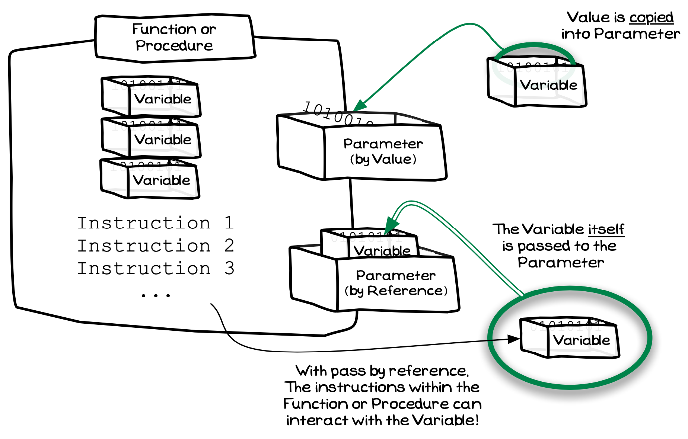

## Concept

There are actually two ways that values can be passed to Parameters. This relates back to the fact that Variables have two aspects: the Value within the Variable, and the Variable itself. These two means of passing parameters allow you to either pass a value, or pass a Variable.

Figure 5.17:  Parameters can accept data by reference or by value
  

## In C#

[TODO]

## Examples

[TODO]

## Activities

[TODO]

:::note[Summary]

- Pass by Reference and Pass by Value are **terms** that explain how data is passed to a Parameter.
- Most parameters are passed by value.
- Pass by value copies the value to the parameter. This means pass by value can work with any Expression.
- Pass by reference allows you to pass the Variable itself to the parameter.
- The main use for pass by reference is to allow the Procedure or Function to store a value in the Variable passed to the parameter.
- It is called pass by reference due to the way it is implemented, with the parameter receiving a reference to the Variable. Section **???** will cover this in more detail, conceptually the Variable itself is passed to the Parameter

:::
