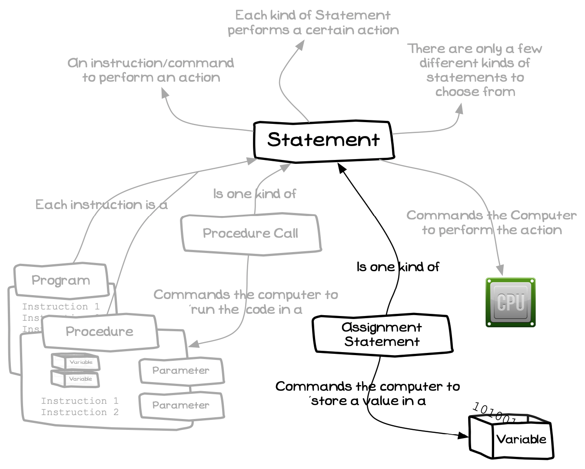

## Concept

Statements are the actions that we can get the computer to perform. At this stage we have covered the statements that run procedures, the [Procedure Call](#procedure-call), and the statement to assign values to variables, the [Assignment Statement](#assignment-statement).

Figure 5.18:  A Statement may be an Assignment statement
  

## In C#

[TODO]

## Examples

[TODO]

## Activities

[TODO]

:::note[Summary]

- Statement is the **term** given to the instructions in our code.
- Statements can be either:
  - [Procedure Call](#procedure-call) used to run the code in a Procedure, as covered in Chapter
  - [Assignment Statement](#assignment-statement) used to calculate a value and store it in a Variable.
- All instructions in your code are Statements, these include the instructions in your Program as well as the instructions in your Procedures and Functions.

:::
