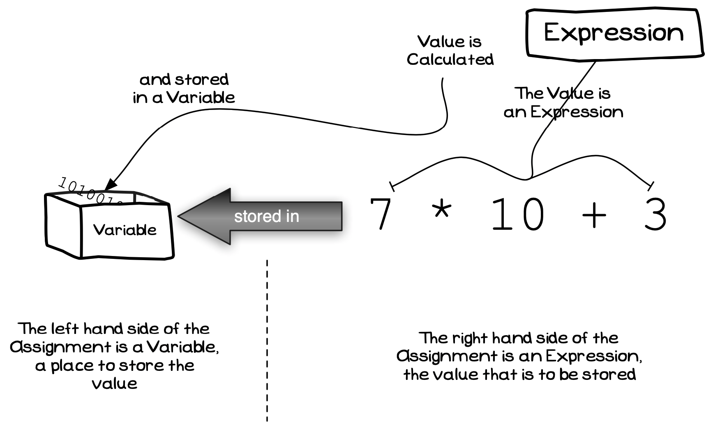

## Concept

The Assignment Statement calculates a value, and stores it in a Variable. You use an assignment statement to store values in variables.

Figure 5.19:  A Assignment Statements assign values to Variable
  

## In C#

[TODO]

## Examples

[TODO]

## Activities

[TODO]

:::note[Summary]

- An Assignment Statement is an **action** you can get the computer to perform.
- The _right hand side_ of the Assignment is an **Expression** that calculates the value to be stored.
- The _left hand side_ of the Assignment is a **Variable** into which the value is stored.
- When the Assignment Statement is executed the Expression is evaluated first, and then the resulting value is stored in the variable.
- Its important to remember that the Variable is a location at which to store a value.
- When the Variable appears on the left hand side of an assignment it is being use to store the resulting value. If the variable appears on the right hand side its value is being used as part of the expression.

:::