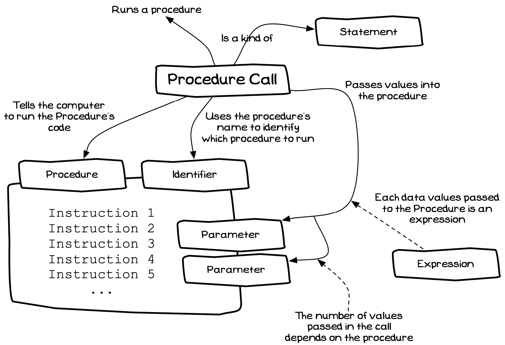

## Procedure Call

A procedure call is a kind of [Statement](../1-statement) that instructs the computer to run the code in a [Procedure](../3-procedure) . This statement uses the procedure's name to identify the procedure that must be run. If the procedure called requires some data, this data is *passed* to the procedure as part of the procedure call. The data passed is called a parameter (or parameters if multiple bits of data need to be passed).

[Figure 5.3](#FigureProcedureCall) shows the concepts related to the procedure call.

<a id="FigureProcedureCall"></a>


<div class="caption"><span class="caption-figure-nbr">Figure 5.3: </span>A procedure calls runs a procedure, passing in values for the procedure to use</div><br/>

### Control flow

A procedure call allows you to run the code in a [Procedure](../3-procedure), getting its instructions to run before control returns back to the point where the procedure was called.

[Figure 5.4](#FigureProcedureCallControlFlow) illustrates the flow of control when a procedure is called.

<a id="FigureProcedureCallControlFlow"></a>


<div class="caption"><span class="caption-figure-nbr">Figure 5.4: </span>The flow of control when a procedure is called</div><br/>

## In C#

The code in Listing 1.3 contains a C# program with four procedure calls. Each procedure call runs the <span class="codeText">write_line</span> procedure to output text to the Terminal.

The procedure call starts with the procedure’s name (its [Identifier](../identifier)) that indicates the procedure to be called: <span class="codeText">write_line</span>.

Following the identifier is a list of values within parenthesis (called parameters), these are the values (coded as [Expressions](../expressions)) that are passed to the procedure for it to use.

Remember that C# is case sensitive so using <span class="codeText">Write_Line</span> instead of <span class="codeText">write_line</span> will not work.

```csharp
int main() {
    write_line("Count back from 2...");
    write_line(2);
    write_line(1);
    write_line(0);
}
```
<div class="caption"><span class="caption-figure-nbr">Listing 5.x: </span>Procedure calls within a C# program</div>

## Summary

:::note

- A procedure call is an **action** in the form of a statement, which commands the computer to run the code in a procedure: You can code a procedure anywhere you can code a statement.
- The [Identifier](../identifier) indicates the [Procedure](../3-procedure) to run.
- Data values passed to the procedure (called parameters) are coded using [Expressions](../expression).
- When the procedure’s task is complete the program continues with the next [Statement](../1-statement).

:::
