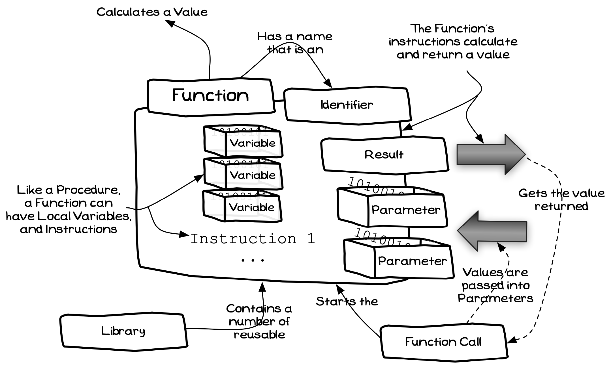

## Concept

Functions are used to calculate values. In many ways a Function is just like a Procedure, it has a name, can be called, can accept parameters, can have local variables, and performs a number of instructions when it is called. Unlike a Procedure, however, Functions are used to calculate values. When the function you called ends it returns back to you with a value.

Figure 5.20: A Function is just like a Procedure, except it calculates and returns a value
  

## In C#

[TODO]

## Examples

[TODO]

## Activities

[TODO]

:::note[Summary]

- A Function is an **Artefact**. Something that you can create and use in your program’s code.
- A Function is just like a Procedure in that it ...
- Has a name that is used to call it.
- Performs instructions when it is executed.
- Can accept Parameters to allow the caller to pass in values. – Is allowed to create its own local variables.
- Unlike a Procedure, a Function...
- Should **not** have any side effects. – Calculates and returns a value.
- Is called as part of an Expression.
  - You use Functions to calculate values.
  - You use a [Function Call](#function-call) to call a function as part of an Expression.

:::