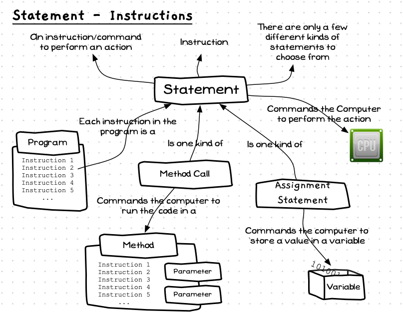

As we explored in the previous chapter, when you are creating a program you define the actions the computer will perform when the program is run. Each of these *instructions* is coded as a **statement** within the program. This style is **imperative** programming. Imperative means to give authoritative commands, and that is what we do in our programs. Our programs are lists of *authoritative commands*, statements, that *tell* the computer the actions it is to perform.

[Figure 5.2](#FigureStatement) shows the concepts related to statements. A statement is a **term** used to describe the instructions in your code, and as such represent an **instruction** or **command** to perform an action. As we have seen, a [program](../../../1-sequence-and-data/1-concepts/00-program) has a list of *statements* that are followed when it is executed. A [Method Call](../../../1-sequence-and-data/1-concepts/03-method-call) is a kind of statement that tells the computer to run the code in a [method](../../1-sequence-and-data/1-concepts/02-method.md). An [assignment statement](../../1-sequence-and-data/1-concepts/08-assignment-statement.md) gets the computer to store a value in a [variable](../../../1-sequence-and-data/1-concepts/07-variable).

<a id="FigureStatement"></a>


<div class="caption"><span class="caption-figure-nbr">Figure 5.2: </span> A statement is a command for the computer to perform an action</div><br/>

## Statement - why, when, and how

As you learn to program, you will need to learn all of the different kinds of *instructions* you can give the computer. These will be **statements** in the programming languages you learn. Just knowing that **statement** means **instruction** will help you engage with these conversations and documentation.

In general a program is a list of statements, where each statement is one of the available statements from the language.

## In C#

:::tip[Syntax]
In a statement you are commanding the computer to perform an action. There are only a small number of statements you can choose from. At this stage we have two statements: [assignment statements](../../../1-sequence-and-data/1-concepts/08-assignment-statement) and [method calls](../../../1-sequence-and-data/1-concepts/03-method-call). This is shown in [Figure 5.x](#FigureStatementSyntax).

<a id="FigureStatementSyntax"></a>


<div class="caption"><span class="caption-figure-nbr">Figure 5.x: </span>C# Syntax for a statement</div><br/>

:::

## Examples

- [Listing 5.x](#ListingMethodCallStatement) below shows an example of method call statements in the program "C# Knights".

<a id="ListingMethodCallStatement"></a>

```csharp
using static System.Console;

// Introduce knights
WriteLine("We are the knights who say 'Hi!'");
Write("We are the keepers of the sacred words:");
WriteLine(" 'Ni', 'Peng', and 'Neee-wom !'");
WriteLine("The Knights Who Say 'Hi' demand a sacrifice.");
WriteLine("We want .... a shrubbery!");

return 0;
```
<div class="caption"><span class="caption-figure-nbr">Listing 5.x: </span>C++ Knights</div>

:::note[Summary]
- A statement is a **term** used to describe the instructions (**commands**) in your code.
- Learning a language involves learning the different kinds of statements and how to write them in code.
:::
