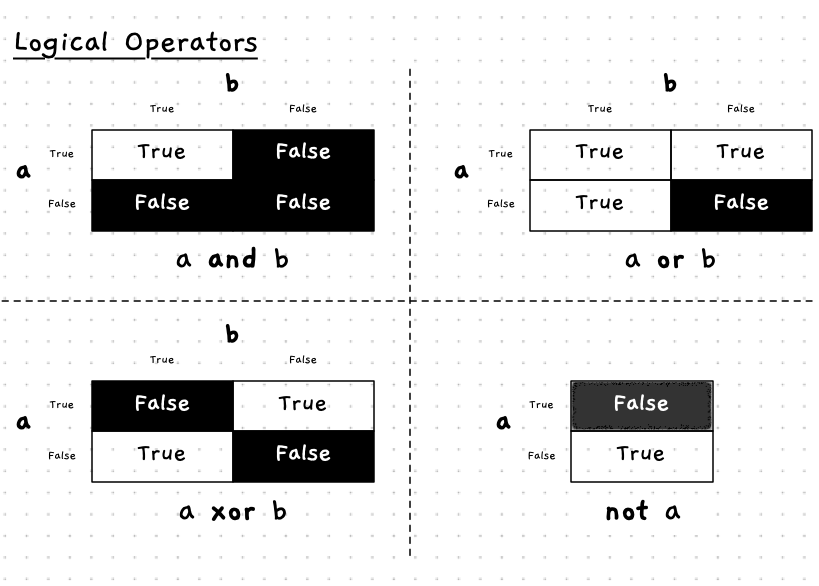

The comparison operators allow you to compare *two* values. This is very useful, but in itself is incomplete. What, for example, do you do when you want to compare three or more values, or you want to check multiple different conditions?

While you are limited to two values with the comparison operators, there are other operators that allow you to **combine** boolean expressions. This will enable you to combine together multiple boolean values into a single boolean expression.

There are four main *logical operators*: **and**, **or**, **xor**, and **not**. The operators **and**, **or**, and **xor** each work on two boolean values, combining them to give a new boolean value. For example, the [and operator](../01-3-and-operator) allows you to check if both of the expressions are true. The considtion `area > 0` **and** `area < 10` will be true only when area is **both** larger than zero **and** area is less then ten. The **not** operator works with a single boolean value, allowing you to check if something is not true.

Truth tables are a great way of visualising the results from these operators. [Figure x.y](#FigureLogicalOperators) shows the four truth tables for the operators we are looking at. Each table shows a single operator joining two placeholder values (`a` and `b`). For our visualisation, `a` is represented as rows and `b` as columns. There is then one row or column for true and another for false, being the only two value that these placeholders could be. Each cell in the table represents one combination of these values, gives you the four potential combinations in the case of the and, or, and xor tables. The table shows you the result of the operation in each cell, thereby showing you all of the possible results based on the different inputs.

Figure x.y: Logical Operators combine Boolean values
 

## Logical Operators - why, when, and how

You often want to check multiple conditions when you are making a decision. For example, to check if the user has clicked something on the screen, you need to check if they have clicked *and* the mouse cursor is over that area. This is a case where **and** is useful.

We could achieve this using something like the following. This will be true when the left button was clicked, and the mouse is 5 to 10 pixels from the left of the window. Explore this in a table as shown below. To help fit this on the page, the table header uses some shorthand names for the parts.

- Idea: The left button was clicked, **and** the X value of the mouse cursor is >= 5 and <= 10
- Code: `MouseClicked(MouseButton.LeftButton) && MouxeX() >= 5 && MouseX() <= 10`

| Clicked? | MouseX() | Clicked? | mx > 5 | mx <= 10 | MouseClicked(MouseButton.LeftButton) && MouxeX() >= 5 && MouseX() <= 10 |
|---|---|---|---|---|---|
| Not clicked | 7 | false | true | true | false |
| Clicked | 7 | true | true | true | true |
| Clicked | 11 | true | true | false | false |
| Clicked | 4 | true | false | true | false |

Notice that in this case we need to have all of the part of the condition being true for the result to be true. This matches what we asked for - the mouse must be clicked and the mouse x between 5 and 10.

With or you can check if **any** of a number of conditions are true. For example, has the user asked to quit or have they typed the escape key. This can be achieved with the following condition. The following truth table shows the possible combinations for this.

- Idea: The user asked to quit, **or** they typed the escape key
- Code: `QuitRequested() || KeyTyped(KeyCode.EscapeKey)`

| Quit? | Escape Key Typed? | QuitRequested() \|\| KeyTyped? |
| --- | --- | --- |
| false | false | false |
| true | false | true |
| false | true | true |
| true | true | true |

In this case you can see that if any one of the values is true, then the result is true. If you ask to quit *or* you type the escape key, then this condition will be true. If you manage to do both at the same time, that will be true as well.

## In C#

This is one area where C# uses cryptic symbols rather than clear text. This is based upon the heritage of C#, which is based upon the C programming language. Rather than using keywords for *and* and *or* orperators, C# uses **&&** for and, **||** for or, **!** for not, and **^** for xor.

|  | Description | Operator | Example |
|---|---|---|---|
| **And** | Are both values true? | `&&` | `a && b` |
| **Or** | Is at least one value true? | `\|\|` | `a \|\| b` |
| **Xor** | Is one value true, and the other false? | `^` | `a ^ b` |
| **Not** | Is the value false? | `!` | `! a` |

Table x.y: Logical Operators
 

:::caution
To make matters worse, new versions of C# have added in **and** and **or** keywords for pattern matching expressions. These differ from boolean operators, so avoid their use.
:::

## Example

<table>
<thead>
  <tr>
    <th rowspan="2">area</th>
    <th rowspan="2">area > 0</th>
    <th rowspan="2">area < 10</th>
    <th colspan="3">area > 0 ... area < 10</th>
  </tr>
  <tr>
    <th>and</th>
    <th>or</th>
    <th>xor</th>
  </tr>
</thead>
<tbody>
  <tr>
    <td>5</td>
    <td>True</td>
    <td>True</td>
    <td>True</td>
    <td>True</td>
    <td>False</td>
  </tr>
  <tr>
    <td>27</td>
    <td>True</td>
    <td>False</td>
    <td>False</td>
    <td>True</td>
    <td>True</td>
  </tr>
  <tr>
    <td>0</td>
    <td>False</td>
    <td>True</td>
    <td>False</td>
    <td>True</td>
    <td>True</td>
  </tr>
</tbody>
</table>

</tbody>
</table>

Table x.y: Example Logical Expressions
 
