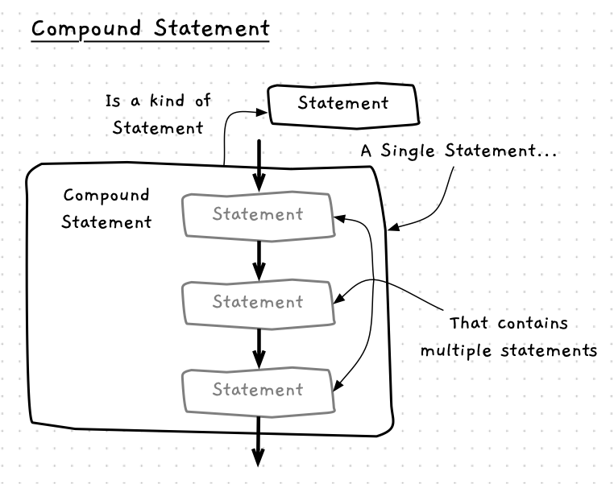

Before we explore the control flow statements we need to make a small detour to see one new statement that programming languages use to simplify their syntax. This is the idea of a **compound statement** - one statement that is actually a grouped list of statements.

The [Branching](../03-branching) and [Looping](../04-looping) statements need to be able to include a number of instructions within their paths. Often languages will manage this by indicating that only a **single** statement can be used, and then provide the ability to code multiple statements in a **single compound statement**.

<a id="FigureCompoundStatement"></a>


<div class="caption"><span class="caption-figure-nbr">Figure x.y: </span>A compound statement is a statement that can contain other statements</div><br/>

:::note

- *Compound Statement* is a **statement** that allows you to create a single statement that contains multiple statements.
- A compound statement may contain 0 or more statements.
- Compound Statements are useful when combined with [Branching](../03-branching) and [Looping](../04-looping) statements. Allowing you to put multiple statements within a path.
- The statements within the compound statement are often referred to as a **block**.

:::

## Compound Statements - Why, When, and How

You will use these compound statements all of the time within the control flow statements. It simply provides you with a way of clearly showing which statements belong within the group, and then the group can be embedded within the other control flow statements.

## In C#

In C# you use braces (`{...}`) to bring together a list of statements. The group starts with the open brace (`{`) and end with the closing brace (`}`) everything in between is part of the group.

:::tip[Syntax]

:::

## Example

You can use compound statements anywhere in your code, but they really make the most sense when combined with the control flow statements.

```csharp
// Demo compound statement
using static System.Console;

WriteLine("Statement 1");

// The next 4 lines are all part of the one compound statement
{
    WriteLine("In the compound statement - statement 2.1");
    WriteLine("This would be statement 2.2");
}

WriteLine("Statement 3");
```
