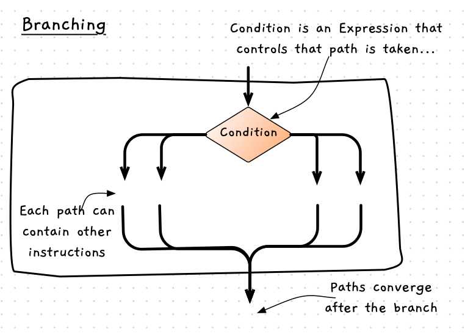

## Concept

There are two main ways of controlling the sequence of actions in a program. The first of these is called **branching**, or **selection**. Branching allows you to get the computer to take one of a number of paths based on the value of a *condition*.

Figure x.y: Branching commands the computer to take one of a number of possible paths
 

:::note

- Branching is a kind of **action**. You can command the computer to take of a number of paths.
- A branch has a **condition** that is evaluated, and based on the condition the computer takes one path.
- The branch is the act of choosing the path, when its command is performed the computer evaluates the condition and then moves to the instructions in the indicated path.
- Languages usually offer two kinds of branching statements:
  - [If Statement](#if-statement) to select between two paths based on a Boolean expression.
  - [Case Statement](#case-statement) to select a path based on an ordinal[1](#FootnoteOrdinalValues) value.
- The Branch will have one entry point, and one exit point. This feature allows you to combine statements together like building blocks. This idea comes from the principles of **Structured Programming**, where each component in the code should have a single entry and exit point.

1Integers and Characters are ordinal values. Ordinal values have a defined sequence, so it is possible to say which value comes next in the sequence. Integers are Ordinal as you can say that the number after 1 is 2. Real numbers are not ordinal as you cannot say which value comes next in the sequence.

:::

## If Statement

The if statement is the most frequently used branching statement. It allows you to selectively run code based on the value of a Boolean expression (the condition). The if statement has an optional *else* branch that is executed when the condition is false.

Figure x.y: If statement lets you selectively run a branch of code
 

:::note

- An if statement is an **action**. It allows you to command the computer to select a path based on a Boolean expression.
- The if statement has two branches, one that is taken when the condition is True, the other when it is False.
- The False branch may *optionally* have instructions that are carried out when the condition is False.
- If there are no instructions you want performed when the condition is False you do not need to include an else branch, and the if statement will just skip the True branch when the condition is False.
- The if statement has one entry point, two paths, and then one exit point.

:::

## Case Statement

The case statement is the second kind of branching statement. This allows you to create paths that execute based on matching a value from an expression. This allows one case statement to handle many alternative paths.

Figure x.y: Case statement selectively runs multiple branches of code
 

:::note

- The case statement is a kind of **action**. It allows you to command the computer to select a path based upon the value of an expression.
- Each path within the Case Statement has a value. When the computer executes the case statement the path values are used to determine which path will be taken. 
- In C and Pascal the Case Statement only works with Ordinal Values. This limits you to using Character or Integer values within the Case Statement’s Expression.
- The Case Statement has one entry point, multiple paths, and then one exit point.

:::

