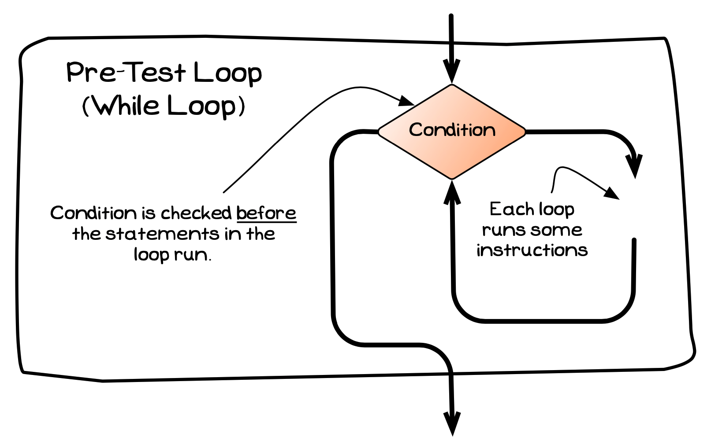
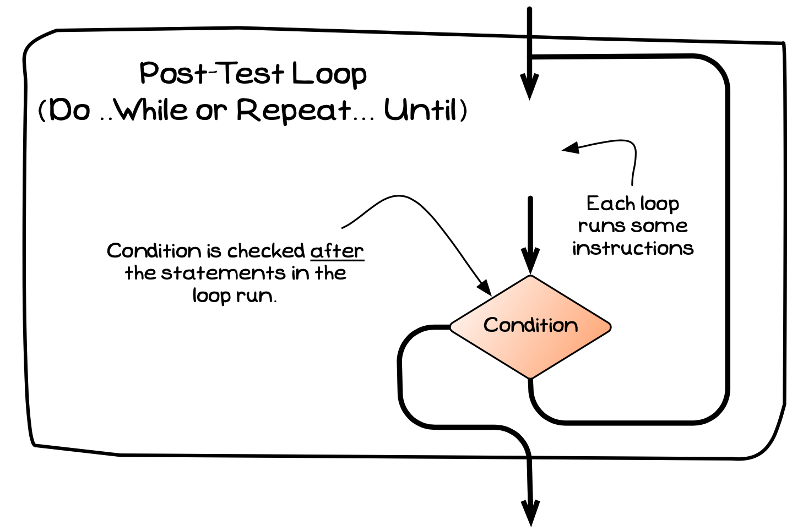

## Concept

There are two main ways of controlling the sequence of actions in a program. The first was **branching**, the second is called **looping**, or **repetition**. The language's looping statements allow you to have actions repeated.

Figure x.y: Looping commands the computer to repeat a path
 

:::note

- Looping is a kind of **action**. You can command the computer to repeat the steps within a path.
- A number of steps are performed each loop:
  - The instructions within the loop are executed.
  - The *condition* is checked, and the instructions are either run again or the loop
ends.
- The *condition* may be checked before or after the instructions are executed, giving two kinds of loops:
  - [Pre-Test Loop](#pre-test-loop): Repeats instructions 0 or more times.
  - [Post-Test Loop](#post-test-loop): Repeats instructions 1 or more times.
  - As with Branching, the Looping Statements have a single entry and a single exit in keeping with the principles of **Structured Programming**.

:::

## Pre-Test Loop

The Pre-Test Loop is a looping statement that allows code to be run 0 or times. The loop checks the condition at the start, and if the condition is True the loop's body is executed. At the end of the loops body the computer jumps back to the condition, checking it again to determine if the loop's body should execute again. If the condition is False when it is checked the loop jumps ends, and control jumps to the next statement in the code.

Figure x.y: The Pre-Test Loop checks the condition, then runs the loop’s body
 

:::note

- A pre-test loop is an **action**, creating a loop in the code’s sequence of instructions.
- The standard pre-test loop is the **while statement**.
- A pre-test loop allows instructions to be run 0 or more times. 
- The condition is checked when the loop’s code is entered, and it is checked again at the end of each loop.

:::

## Post-Test Loop

The Post-Test Loop is a looping statement that allows code to be run 1 or times. The post-test loop places the condition after the body of the loop. This means that the first time through the body of the loop must
execute before the condition is checked. When it gets to the end of the body, the loop's condition is checked and the computer either jumps back to the start of the loop to repeat the body, or the loop ends and control flows on to the next statement in the code.

There are two common variants for the post-test loop: `do...while` and `repeat...until`. These work in the same way, in that they test the condition after the loop body, but the conditions they use will be different. The **`do...while`** loop repeats the body of the loop when its condition is **true**, **`repeat...until`** repeats the body of the loop when its condition is **false**. When implementing a post-test loop you must make sure that the condition you use matches the kind of loop supported by your language.

Figure x.y: The Post-Test Loop runs the loops body, then checks the condition
 

:::note

- A post-test loop is an **action**, creating a loop in the code’s sequence of instructions.
- A post-test loop allows instructions to be run 1 or more times.
- The condition is checked after the loop’s body is executed, with control jumping back to the start if needed.

:::

:::note[C#]

C++ includes support for the `do...while` loop

:::

