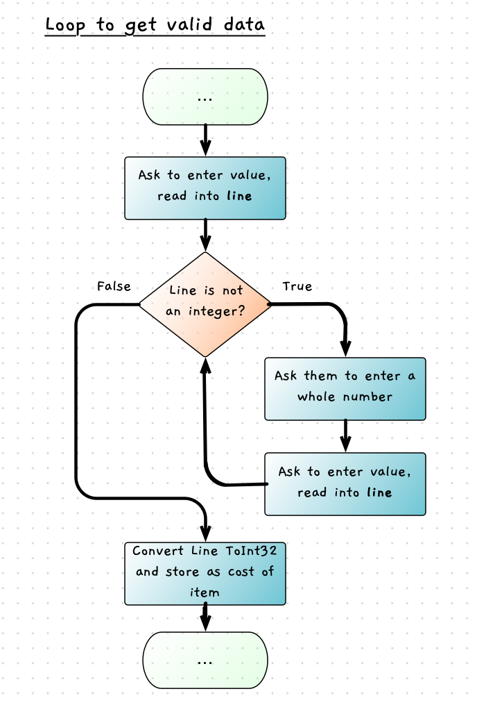
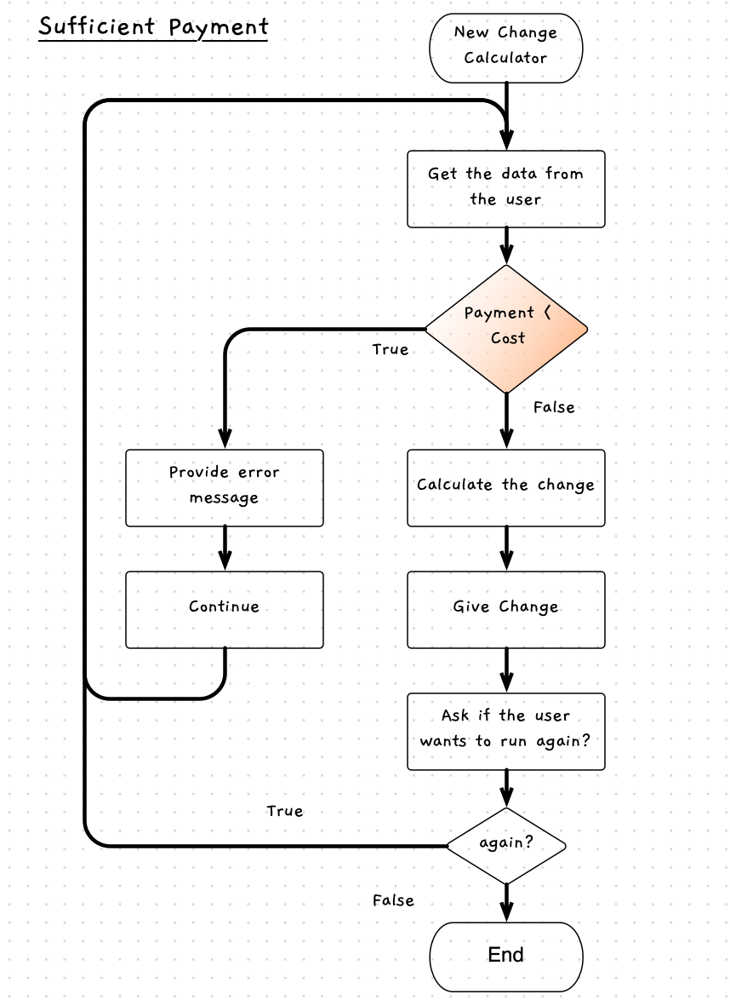

The next thing we can fix are a couple of validation issues. Firstly to check that the user enters a whole number for the cost and payment, and then a check to see that the payment was sufficient.

## Values are Whole Numbers

When the user enters text other than a whole number for the cost or payment, then the program will crash. This is never a good thing, and we have to expect that users will make errors (intentionally or by mistake).

:::tip

Validations are an important part of every program. You have to anticipate the different ways that users will work with your programs.

:::

For this, let's look at the code we have at the moment. The code that I had looked like this:

```csharp
int costOfItem = ToInt32(ReadLine());
```

This reads the line in, and sends it directly to `Convert`'s `ToInt32` method. If the data is not a number, `ToInt32` raises and error that causes our program to crash.

To work around this we need to add some extra steps in here. Rather than just sending the data straight to the convert method, we can first check if it is an integer, and if not we can ask the user to enter the value again.

This sounds like a branching statement, but think about it a little more. What if the user *still* enters something that is not a number. If we just ask them to try again once, that may not be enough. In fact, we don't know how many times the user will need to be asked to enter a valid value. So this is not a branch, but another loop. We need to continue to ask for a valid value while the user has not provided one.

The logic for this looks like this:



For this we are using a while loop, as we have different messages based on valid and invalid data entry. The loop will need to test if the line entered is **not** an integer, and repeat the code when that is true.

In order to do this, we will need to use the `IsInteger` method from SplashKit. The method that C# uses is a little more involved, so we will come back to that later. For now, the SplashKit method will meet our needs. As both SplashKit and Console provide ReadLine and WriteLine methods, we should switch the using statement to use the `SwinGameSDK.SwinGame` library.

The pseudocode for this logic would be:

```
Write the prompt to the user
Store their response in line

While line is not an integer
    Output a message saying we need whole numbers
    Write the prompt to the user
    Store their response in line

Convert line to Int32 and store in costOfItem
```

Have a go at implementing this yourself now. Start with the cost of the item, and then update the payment as well. Test it out and try breaking this with different combinations of errors. Make sure it also works with valid integers.

:::tip
Remember to using the using directive at the top.

```csharp
// using static System.Console;
using static SwinGameSDK.SwinGame;
using static System.Convert;
```

:::

## Sufficient Funds

Another test we need is to check to see if sufficient funds have been provided. If the payment is less than the cost, then we can end this transaction as there is no need to provide change in this case.

There are a few ways we could implement this, both will involve a branch where we can skip over the change calculations and output when there are insufficient funds.

Option 1 will use if and else, where one branch gives change and the other outputs an error message. This will allow us to check if the user wants to run the program again in either case.


The pseudocode for this is as follows.

```plaintext
Constants:
  TWO_DOLLARS = 200;
  ONE_DOLLAR = 100;
  FIFTY_CENTS = 50;
  TWENTY_CENTS = 20;
  TEN_CENTS = 10;
  FIVE_CENTS = 5;

Variables:
  costOfItem - integer
  amountPaid - integer
  changeValue - integer
  toGive - integer
  again - string (initialise to "")

Steps:

  Do
    Get the details from the user.
    
    If Payment >= Cost Of Item
        Calculate the amount of change to provide 
        Give change
    Else
        Output an error message
    
    Ask the user if they want to run again
    Read string from user into again
  While (again != "N" and again != "n")
```

Another option is to test for the error, and use the [continue](../../1-concepts/05-2-continue) statement within the branch to jump back to the start of the loop. Though this will skip asking the user if they want to enter another payment, and also breaks the elegant structured programming approach of the first option.



```plaintext
Constants:
  TWO_DOLLARS = 200;
  ONE_DOLLAR = 100;
  FIFTY_CENTS = 50;
  TWENTY_CENTS = 20;
  TEN_CENTS = 10;
  FIVE_CENTS = 5;

Variables:
  costOfItem - integer
  amountPaid - integer
  changeValue - integer
  toGive - integer
  again - string (initialise to "")

Steps:

  Do
    Get the details from the user.
    
    If Payment < Cost Of Item
        Output an error message
        Continue
    
    Calculate the amount of change to provide 
    Give change

    Ask the user if they want to run again
    Read string from user into again
  While (again != "N" and again != "n")
```

Have a go at implementing one of these two options. Both will work. Look at the examples and syntax related to the [if statement](../../1-concepts/03-1-if) and the [continue statement](../../1-concepts/05-2-continue) if you use it. Compile and test to make sure that this works as expected. Try testing with the exact amount, and a little over and a little under. These are where errors are more likely to occur.

:::tip

Make sure to indent the code within the if statement to help make the structure of the code apparent. See how this is done in the pseudocode above. Indenting code within these statements helps make it clear which lines are within the loop or branch and those that follow it.

:::

Remember at each step you want to make sure that you have the software working. When you encounter issues, make sure to address these now. Work through them one at a time, starting with the first error, reading the error message carefully, and addressing them before moving on. If you get stuck, you can check the wrap up for the code that we developed - though remember that there are always several ways that you can achieve this.

:::tip

Persistence and attention to detail are important attributes for IT professionals.

:::
