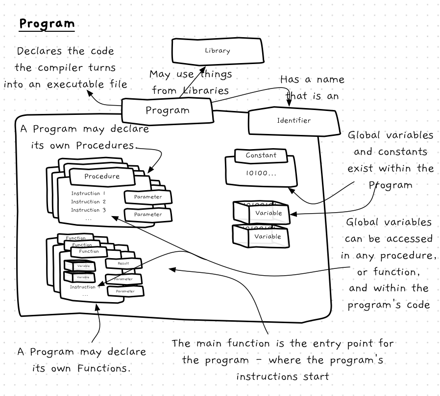

In order to organise your code, programs need to become more than just a list of instructions with variables. In this chapter you will see how to organise your code into functions, procedures, constants, and global variables. Generally there would be a few constants, no global variables, with the majority of the program being divided into many functions and procedures. 

This means that you now need to picture your program as being built up of functions and procedures, with the associated constants and global variables as required.



<div class="caption"><span class="caption-figure-nbr">Figure 5.15: </span> Programs contain functions, procedures, constants, and global variables</div><br/>

## Program - Why, When, How

The role of the program has not changed, it is still the main thing that people will run. What changes is what we can see within the program. With this material, you now have the ability to start to build larger programs by organising your code in functions and procedures, with related constants and global variables.

This change results in a new way of approaching the program design. You don't need to start with low level details like specific logic. Instead, you can break the problem down into functions and procedures. 

:::tip[Decomposition]

This activity is known as **decomposition**. You can break things down functionally, through **functional decomposition** by thinking about the different functional aspects that will be involved. Each of the different things you identify through this process can become a function or procedure in your code, allowing you to tackle the complexity involved in large programs a piece at a time.

:::

## In C/C++

:::tip[Syntax]

The syntax in [Figure 5.x](#FigProg) shows you the general program syntax which can now contain these new elements.

<a id="FigProg"></a>


<div class="caption"><span class="caption-figure-nbr">Figure 5.x: </span>The syntax related to the declaration of global variables within a C/C++ program</div>

This is the syntax for any C/C++ file. For the file to contain a valid program, you need to ensure that one of the functions within the program has the name `main`, and that it returns an integer value.

:::

### Header include

The `#include` code allows you to include the header files that contain declarations for the different things you are going to use within your program. When you include a header file you gain access to the functions, procedures, constants, and variables declared within that file. You can then either compile the code for these yourself, or link in an existing library.

These are similar to the `using` statements in the C# code.

### Using directives

One of the challenges in programming is uniquely naming things we create. To help manage this, programming languages have come up with a mechanism to create **namespaces**, which allow you to define the scope in which a name must be unique. The using directive gives you easier access to particular items within another namespace.

In C/C++ the standard name space (which has the identifier `std`) contains some useful functions. You can access these anywhere using the full name of the function, which add the namespace name before the identifier, separated by two colons. For example, the `to_string` function in the standard namespace can be accessed using `std::to_string`. This will always work, but means you have to type `std::` before `to_string` each time. The `using` statement lets you avoid this. By adding `using std::to_string;` at the top of the code, you can now just use `to_string` everywhere and the compiler is ok, as you have told it you are "using" `std::to_string` so it will expand this for you.

## Example

Here is the code of a program with functions that includes some additional comments to help link this with the syntax itself.

```cpp
// includes and using statements

// - a header include
#include "splashkit.h"

// - a using directive
using std::to_string;

// a global constant declaration
const double PI = 3.1415;

// a function declaration
double square(double val) 
{
  return val * val;
}

// a function declaration
bool pount_in_circle(double pt_x, double pt_y, double c_x, double c_y, double c_radius)
{
  double distance = sqrt(square(pt_x - c_x) + square(pt_y - c_y));
  return distance <= c_radius;
}

double circle_area(double radius)
{
  return PI * square(radius);
}

// a function declaration - the main / entry point function
int main()
{
  write_line("5 squared is " + to_string(square(5.0)));

  write_line("A point at 1, 3 is in a circle at 0, 0, with radius 4" + to_string(point_in_circle(1, 3, 0, 0, 4)) );

  return 0;
}

```

When you picture this program, you can see it as containing a constant and three functions - one for the entry point, and two others to code parts of the program's functionality.
