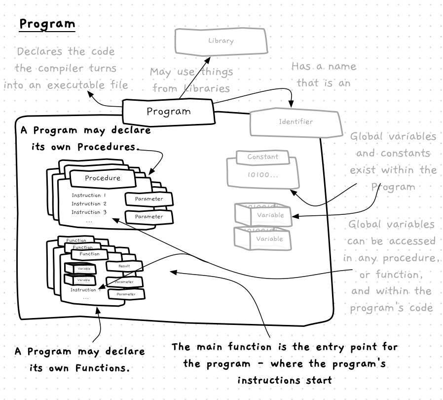

Programming languages need a way to help you manage the complexity of your code. To do this, they provide the ability to **group** instructions into reusable chunks of code. In C#, these were known as methods, in C/C++ these are functions, while in Pascal there are functions and procedures.

While C/C++ does not distinguish between functions and procedures, I think it is good to start with these two concepts separately in our minds.

- **Procedure**: a procedure is a named group of instructions that will perform an action.
- **Function**: a function is a named group of instructions that will calculate/retrieve a value.

This means that procedure **do things**, whereas functions **calculate things**. If we think of some functions and procedure we have used, you can see this distinction. Write Line, for example, is a procedure. It does something. It writes text to the terminal. Is Double, on the other hand, is a function. It calculates something. It determines if a string can be converted to a double, and returns a boolean value to indicate if this is possible.

## Functions and Procedures - Why, When, and How

You can now create your own functions and procedures to help you organise your own code. When you identify a reusable group of instructions, you can code this as a function (if it calculates a value) or a procedure (if it does something).

Doing this is going to make your code **SO** much easier to work with.

This will help to further reduce duplication in the code, allowing you to create small reusable tools and processes that you can call upon when needed.

An important aspect here is the way this feature lets you **isolate** these different groups of code from each other. You have been able to use Write Line this whole time without knowing how it works internally. So you can now do this with your own code - once you have a part working, you no longer need to focus on how it works.

When you are working on the code in one function or procedure, you can focus on it entirely. What do you need to change in its logic to add or fix the aspect you are working on? While the whole program may be many thousands of lines long, you can just focus on the few lines within this one function or procedure, and make calls to the other parts you have already created - without worrying about how they work internally.

When you finish with that part, go to the next function or procedure you need to work on. You can now focus entirely upon this one function or procedure. No need to worry about the others, as you can focus on them if and when you need to. For now, that little piece of code is all you need to get working.

:::tip[Learning to focus]

Learning to move your focus between these different compartments may take some getting used to. Don't try to keep all the logic in your head - you can't and don't need to! When you are **in** a function or procedure, become that code and only that code. Pretend everything else works. So you can call functions and procedures, even if they don't work or don't exist yet. That is ok, you can focus on them next.

:::

In the next section we will look at how to declare a procedure, then we can look at functions after that.

## In C/C++

