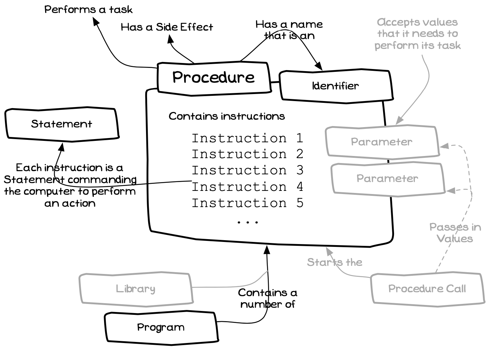

Procedures contain code that define the steps the computer performs when the procedure is called. In your Program, you can define your own procedures, allowing you to divide a program's tasks into separate steps.

<a id="FigureMethodDeclaration"></a>


<div class="caption"><span class="caption-figure-nbr">Figure 5.14: </span>Procedures</div><br/>

## In C/C++

:::tip[Syntax]

A basic stating syntax for a C/C++ procedure declaration is shown in [Figure 5.15](#MethodDeclarationSyntax) below.

- A **procedure declaration** starts with the `void` data type. This indicates that the following code is a procedure declaration to the compiler, and that it will return no data. In C/C++, `void` is a data type used to indicate the absence of return data.
- The **procedure name** is an identifier. It is the name of the procedure. This can be any valid [identifier](../../../../part-1-instructions/2-communicating-syntax/1-concepts/04-identifier) that has not been used before.
- The empty parenthesis must appear after the procedure’s name, and before the *block* which contains the statements that define the procedure's logic.

<a id="MethodDeclarationSyntax"></a>


<div class="caption"><span class="caption-figure-nbr">Figure 5.15: </span>The syntax for method declarations</div><br/>

:::

## Examples

There are three procedures declared in the code in [Listing 5.12](#ListingMethodDeclaration).

- The **block** of a procedure declaration should look familiar. This is the same as was used in the main function of the program to define its instructions, and is used for the same purpose within the procedure declaration.
- There are a number of conventions, called coding standards, that describe how your code should appear for a given language. In this text we will use a common C convention of having all *procedure names* in **snake_case**, with underscores ( ) used to separate words. So the *Get Ingredients* procedure becomes `get_ingredients`.


<a id="ListingMethodDeclaration"></a>
```cpp
/*
 * Program: print_steps.cs
 * Prings out the steps to cook a meal... (partial)
 */

#include "splashkit.h"

void find_what_to_cook() {
    write_line("Step 1 - Find what to cook -");
    write_line("1 - Find a recipe book");
    write_line("2 - Pick recipe");
} 

void purchase_missing_ingredients() {
    write_line("Step 2(a) - Purchase Missing Ingredients -");
    write_line("1 - Goto Shop");
    write_line("2 - Find ingredients and put in basket");
    write_line("3 - Go to register and pay for ingredients in basket");
    write_line("4 - Return home");
}

void get_ingredients() {
    write_line("Step 2 - Purchase Ingredients -");
    write_line("1 - Read recipe");
    write_line("2 - Write a list of ingredients");
    write_line("3 - Check food stocks, and tick off ingredients you already have");
    purchase_missing_ingredients();
}

int main() {
    find_what_to_cook();
    get_ingredients();
    // etc...

    return 0;
}

```
<div class="caption"><span class="caption-figure-nbr">Listing 5.12: </span>C# program for cooking a meal showing three method declarations</div>

:::note[Summary]

- A procedure is an **building block** that you can create and use in your code.
- Each procedure contains code to perform a certain task. When you want the task
performed you call the procedure.
- Procedures should have a **side effect**, meaning that it changes something when it
is executed. Output to the Terminal is an example of a Side Effect. After calling these methods the text you wanted to appear was written to the Terminal. These Methods changed the Terminal.
- The procedure's declaration defines its **name**, and the **steps** it performs.
- Each instruction in the procedure is a [statement](../../../part-1-instructions/2-communicating-syntax/1-concepts/02-statement).
- The procedure's [identifier](../../../../part-1-instructions/2-communicating-syntax/1-concepts/04-identifier):
  - Is the name used to call the procedure.
  - Should be a **verb** that **reflects the task** the procedure performs.
- When the procedure is called, its instructions are executed.
- Each procedure's instructions are **isolated** from the other code in your program. When you are working on a procedure, you do not need to know about the internal workings of the other procedures.

:::
