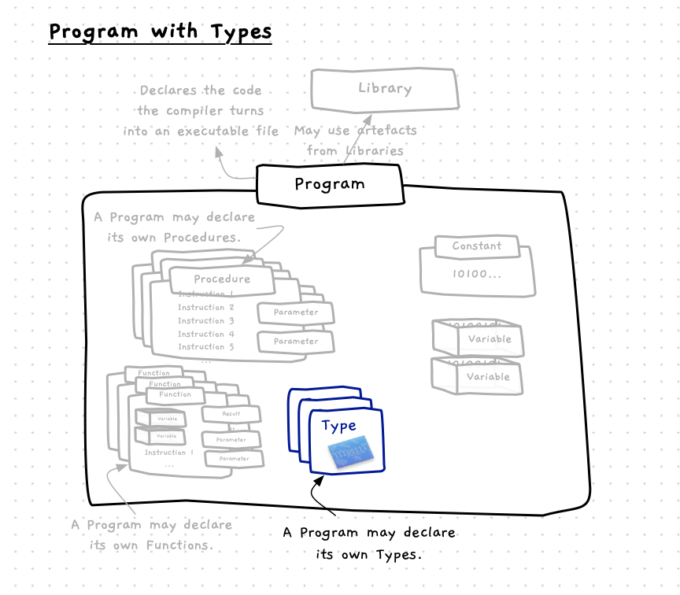

## Concept

The Program is the overarching artefact, containing the code that defines the other artefacts that we have been creating. When you want to declare your own types, you do so in your program's code. This makes it possible to model the data, in the same way as you model the actions in your code.

Figure x.y: A Program can contain Type Declarations
 

:::note

- A program is an **artefact**, it is the container within which you code other artefacts such as your functions, procedures, constants, and now types.
- The types you declare in your program will be available for use within the program’s code, and your functions and methods. 
- You will be able to create [Variables](../../../../part-1-instructions/1-sequence-and-data/1-concepts/08-variable) (including [Arrays](#)) of the types you create. They will store the values in the format you specified. This includes [Parameters](#) and [Local Variables](#).

:::