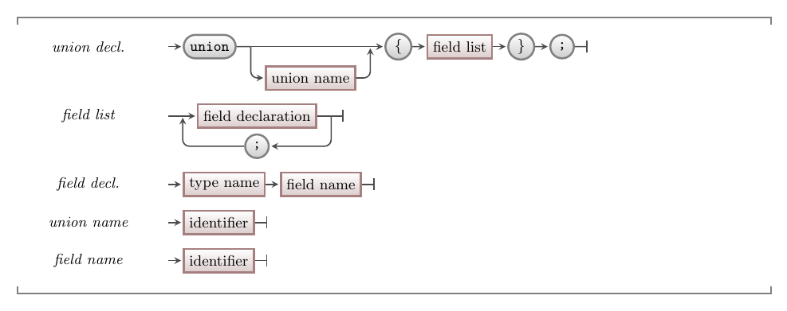

Structs and enums are by far the more common mechanism used for creating custom types. The union is rarely used, though it can add some interesting options if you do master it.

A union allows you to declare a type where the values may be one of a number of alternative types. For example, you can say a variable can store an integer, double or a warning level. The compiler will then make sure there is enough space to store the largest one of these, but you have to remember which type is actually stored there at any time.

A union works best when it is accompanied by a **tag** value. This value then records the kind of data currently being stored in the union variable. A good option is to use an [enumeration](../03-02-enum) for the tag's type, giving you a range of value, that you can match to the range of types stored in the union. The union and its tag can then be coded in a struct, ensuring that you always have the necessary details, being the tag and the union's value, together.

<a id="FigureCustomTypeUnion"></a>


<div class="caption"><span class="caption-figure-nbr">Figure x.y: </span>A Union is one type that can store one of a range of other types</div><br/>

:::note

- A union is a kind of **building block** that you can declare.
- The union allows you to use one location in memory to store one of a number of types of value.
- At any one time these variables can be used to store **one** of these values.
- It is your responsibility to ensure you access the right kind of value when you use a union.
- A **tag** value can be used to store a marker that indicates the type of data being stored in the union.
- The **size** of a union is the size of its *largest* option. For example a union of a `char`
(1 byte), a `int` (4 bytes), and a `double` (4 bytes) would require 4 bytes, the size of the largest kind of value it needs to store.

:::

## Union Why, When, and How

You will not often need a union. The only time you may want to use this is when you want to mix types within a location in your program. There are probably other ways you will be able to do this, but sometimes the union can be used. In these cases you should set up the union and an enum to track which kind of value is stored.

## In C/C++

:::tip[Syntax]

The syntax for a union is similar to a struct, though it only stores a single value, so each field should be of a different type.



:::

```cpp
union my_union
{
    int int_value;
    double dbl_value;
    string str_value;
};

typedef enum
{
    INT_VALUE,
    DBL_VALUE,
    STR_VALUE
} data_tag;

typedef struct
{
    data_tag     tag;
    union my_union  value; 
} data_value;

int main()
{
    data_value val;

    // use it to store an integer value
    val.tag = INT_VALUE;
    val.value = 10;

    // use it to store a double value
    val.tag = DBL_VALUE;
    val.value = 3.14;

    // use it to store a string value
    val.tag = STR_VALUE;
    val.value = "Hello World";

    // Remember it only stores one value...
}
```
