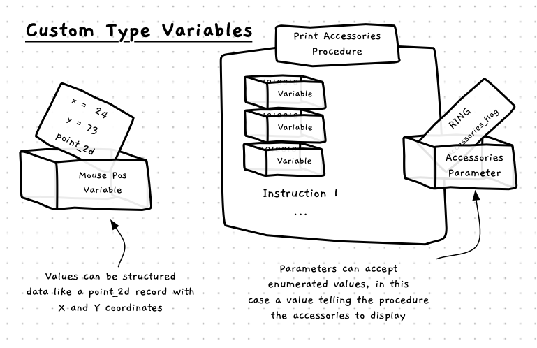

## Concept

The custom types allow you to specify a data format. To make use of this format you must declare variables that use this type. The type can be used to declare [Local Variables](#) and [Parameters](#), allowing you to store values in this format and pass the around between your functions and procedures.

Figure x.y: Some examples of how you can use your types to declare the kind of data stored in variables
 

:::note

- Variables declaration is the **term** given to the code that creates Variables.
- The Variables you create store data as described in your custom type definitions.
- In [Figure x.y](#FigureDeclaringVariablesWithCustomTypes) there are the following examples:
  - `Mouse Pos`: A Variable that stores `Point Record` data.
  - `Data`: [Array](#) that stores `Data` values which are either integer, double, or text values using a [Union](../03-type-declaration#union).
  - `kind`: Parameter that passes in an [Enumeration](../03-type-declaration#enumeration) value from the `Data Kind` type.
  This value can then be used by
- You can combine these types in a huge variety of ways. The best idea is to try and model the entities related to your program.
 

:::