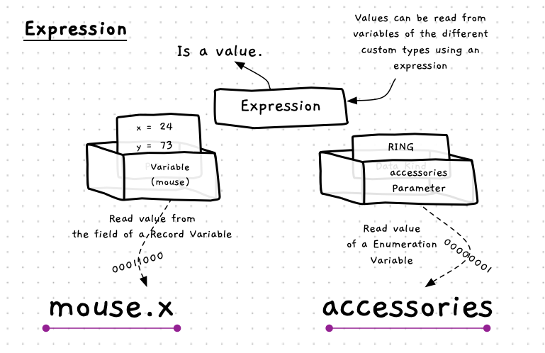
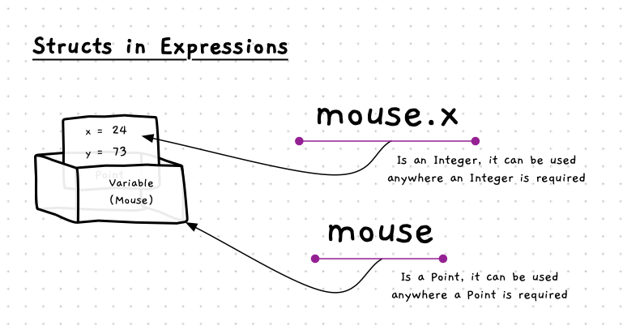
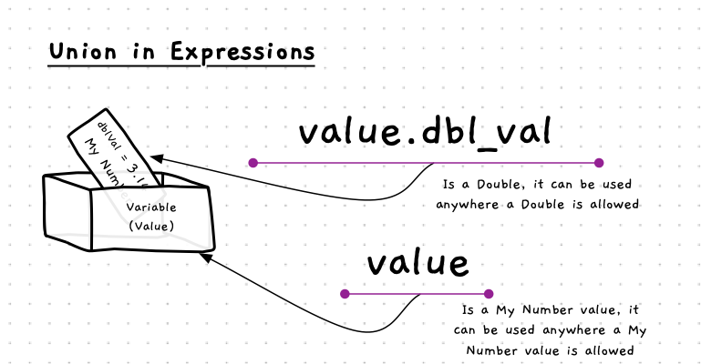

## Concept

The types you define allow you to specify how data values can be formatted, allowing you to declare variables that contain data in this new format. You can then read data back from your variables in expressions.

Figure x.y: An expression can read the value of a record’s field, a union’s field, and from an enumeration
 

:::note

- Expression is the **term** given to the code that calculates values within your Statements.
- Within an expression you can read the value from... 
  - a field of a record.
  - a field of a union.
  - an enumeration.
- The dot (`.`) notation is used to indicate which field you want to access from a record or union.

:::

## Record Expressions

A [Record](../03-type-declaration#record) is a type that contains a number of fields. When using a record value
you can use either an individual fields from the record, or the record
in its entirety.

Figure x.y: A field of a record can be used, or the record can be used in its entirety
 

:::note

- [Figure x.y](#FigureRecordExpression) shows some examples of expressions on a record variable and array
- The `Point` record in the illustration has an `x` field that stores an integer value.
- You can access a field of the record from its variable using the dot notation. So `mouse.x` reads the `x` value form the record stored in the `mouse` variable. This value is then an Integer, and can be used anywhere an Integer is allowed. For example, you could have this in an equation where the value was subsequently stored in an Integer variable or passed to an integer parameter.
- You can access the entire record using just `mouse`. This expression has the `Point` type. It can be used anywhere a Point can be used. For example, it could be stored in another `Point` variable, or passed to a `Point` parameter.
- In an array of records, each element has the records type. In [Figure x.y](#FigureRecordExpression) the `points` array is storing 3 `Point` values. This means the `points` is an expression to access the entire array, `points[2]` accesses the 3rd element and therefore has a `Point` type, and `points[2].x` accessed the `x` value of the 3rd element of the `points` array.

:::

## Union Expressions

A **Union** has multiple fields that all give access to the same piece of memory. In effect, the union stores only *one* of the values from its available fields. This allows you to create a type that can be used to store one of a selection of available values.

Figure x.y: A field of a union can be used, or the union can be used in its entirety
 

:::note

- A Union is very similar to a Record, the only difference is that the union only stores one of the field values.
- [Figure x.y](#FigureUnionExpression) shows an example of a union variable and array.
- The expression `value` gives access to the union stored in the variable. This has a `UserData` type and can be used anywhere a `UserData` value can be accepted.
- The expression `value.dblVal` is a `Double` value, and can be used anywhere a `Double` is allowed.
- Accessing a union value from an array is similar to accessing a record value. In [Figure x.y](#FigureUnionExpression) you can access the array in its entirety using `data`, you can access the first `UserData` value using `data[0]`, and you can access its text value using `data[0].txtVal`
- When accessing the data in a Union you are responsible for ensuring you read it using the correct field. For example, it is possible to read the data stored in `value` using `value.intVal`. This will not cause any errors during compiling or running, but the value read will be the Integer interpretation of the `Double` value stored in the variable.
 

:::

## Enumeration Expression

The [Enumeration](../03-type-declaration#enumeration) is the simplest of the custom types to make use of. It defines a list of available options for values of this type. This means that enumerations are just like standard values.

")

Figure x.y: You interact with an Enumeration just like other simple data types (Integers, and Doubles for example)
 

:::note

- Accessing an value of an Enumeration type is just like accessing an Integer or Double value.
- In [Figure x.y](#FigureEnumerationExpression) the `kind` variable is storing a `Data Kind` value. This value can be read from the variable using the variable’s name (its [Identifier](#)).
- The `kinds` variable is an array of `Data Kind` values. The expression `kinds` is an array of `Data Kind` values and can be used anywhere the array would be accepted. `kinds[0]` is a `Data Kind` value and can be used anywhere a `Data Kind` value can be used.
 

:::