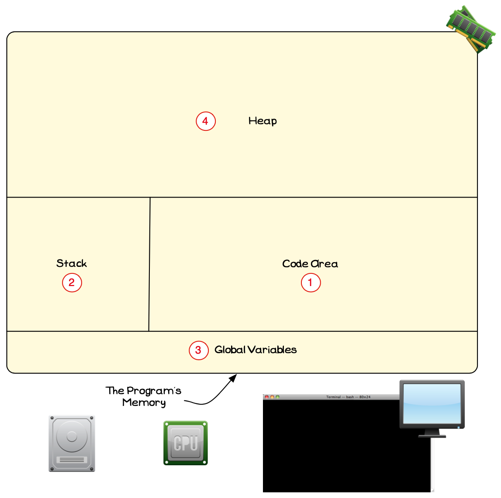
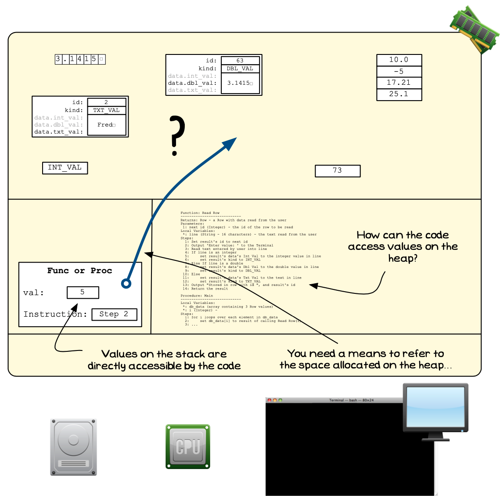

## Concept 

When your program is executed it allocated memory to work with. This memory is divided into different areas based on the kind of values that will be stored there. Previously all of the program’s data was housed on the Stack, dynamically allocated memory is allocated into a separate area known as the Heap. Any memory that you allocate to your program will come from this location.

Figure x.y: The Heap is used to store all dynamically allocated values
 

:::note

- [Figure x.y](#FigureTheHeap) includes the following areas:
  1. Your program’s machine code is loaded into the **Code Area**.
  2. The **Stack** is used to manage the execution of the program’s functions and procedures.
  3. **Global Variable**s are allocated their own space.
  4. The new area is the **Heap**. This is used to store all dynamically allocated values.
- Values can be stored in the *global variables*, in local variables on the *Stack*, and on the *Heap* using dynamic memory allocation functions and procedures.
- The space taken up by the **global variables** is fixed based on the size of the variables you have declared
- Each function/procedure takes a fixed amount of space on the stack. The space allocated is enough to store each of the local variables, plus some additional space for various overheads.
- The compiler take care of managing memory in the stack and for the global variables.
- **You** are responsible for any memory allocation done on the heap

:::

## Allocating memory on the heap

Dynamic memory allocation is performed with a couple of operations that will be provided by the programming language you are using. These operations allow you to do the following:

- **Allocate Space**: You ask the Operating System to allocate you some space into which you want to store a certain value. The Operating System will then allocate you space on the Heap that is large enough to store the value you require.
- **Free Allocation**: When you have finished using a piece of memory you have been allocated on the Heap, you can tell the operating system that you have finished with this memory, and that it is free to allocate this to some other value.

These are the two basic actions that exist for performing dynamic memory management. Basically, you can ask for memory, and you can give it back. Once you have been allocated space, that space will be reserved for your use until you free that allocation. So it is important to remember to free the memory you have been allocated when you no longer require it.

Figure x.y: You can ask for space, and return the space you were allocated
 

:::note

- [Figure x.y](#FigureAllocateHeapMemory) shows the idea behind the two operations.
- You can ask to be allocated space, this will give you access to a space on the heap. You can then use this to store a value.
- You can tell the Operating System when you are finished with the space, so that it can allocate it to something else.

:::

## Accessing dynamically allocated memory

By its very nature, dynamic memory allocation must work a little differently to the way we have been working with values so far. So far, when you wanted to work with a value you declared a variable, or an array. This would have been a [Local Variable](#), with its value allocated on the stack along with the other variables you were working with in the current function or procedure. The variable and its value were closely related, with the value being located within the variable. With dynamic memory allocation the values you are allocated are on the heap. This means that their values are not bound within a variable, but exist entirely outside of any variables that appear in your code.

One of the challenges of working with dynamically allocated memory is that you can no longer ‘see’ these values in your code. When you were working with variables, they were in the code, you could see them and think about the value they stored. With dynamically allocated memory you do not have this advantage, these values will be allocated as a result of the operations that are performed while the code is running. This is why it is called **dynamically** allocated memory. It is not memory allocated to variables, it is **memory allocated upon request**.

This raises one very important question, as illustrated in [Figure x.y](#FigureAccessingMemory): 

> If the values exist outside of variables, how do you access them? 

For this we require a new kind of data, a new [Type](../../../../part-1-instructions/1-sequence-and-data/1-concepts/07-type). This type is used to store a value that tells you where the data you want can be located. It is like an address, telling you where the data can be found. This is the [Pointer](#pointer) type.

Figure x.y: How can you access these dynamically allocated values?
 