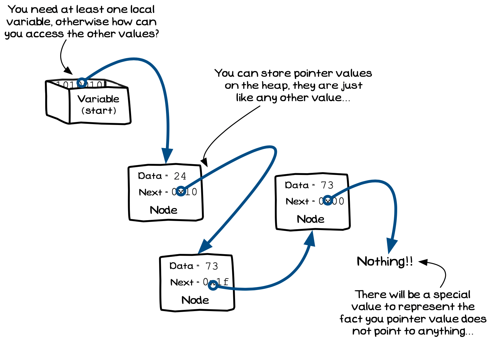

One of its key ability, however, is the ability to point to values on the [Heap](../01-heap).

[Figure x.y](#FigurePointerStore) shows an illustration of some values in memory. The `start` variable is located somewhere on the stack as a local variable. This variable is storing a pointer value that points to a `Node`[1](#FootnoteNode) that is on the Heap. Each of the nodes on the heap are also storing pointer values that refer to other values that are also on the heap.

Figure x.y: Pointers can be stored anywhere a value can be stored
 

## Using pointer to access the heap

Pointers can be used to point to locations in the heap. When you ask the Operating System to allocate you space on the heap, it will give you a pointer value that *points* to the space you were allocated. You can use this pointer to access the value at that location.

Figure x.y: You can use pointers to access values on the heap
 

:::note

- Your code can access values stored on the stack, in its local variables and parameters.
- There is no way to directly access values on the heap.
- The memory allocation functions will give you a pointer to the space you were allocated.
- Storing the pointer in a local variable will mean you can use it to access the value on the heap.

:::

