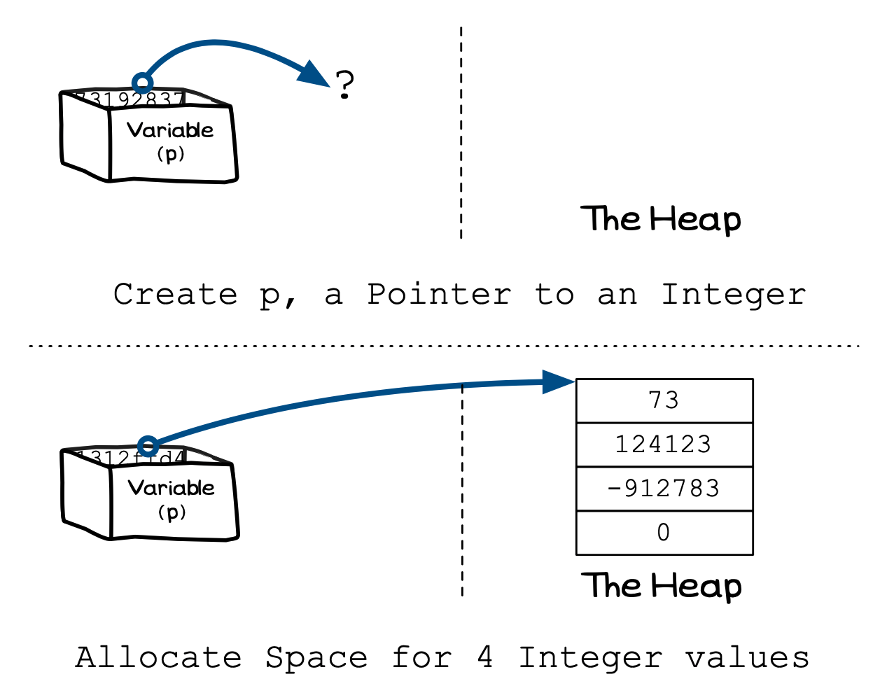

Storing single values on the heap can be useful, but often you want to be able to allocate enough space for a number of values. This uses the same memory allocation functions, but requires you to pass in the size of the type you want multiplied by the number of elements you want.

<a id="FigureArrayAllocateMemory"></a>


<div class="caption"><span class="caption-figure-nbr">Figure x.y: </span>You can ask to be allocated a number of values</div><br/>

## In C/C++

In C you can use `malloc` to allocate space for a number of elements. Alternatively the `calloc` function from `stdlib.h` provides direct support for allocating space for an array. This function takes two parameter, the first takes the number of elements to allocation, the second the size of those elements. `calloc` also clears its allocation, setting each byte allocated to 0. 

The following code allocates 4 integer values as shown in [Figure x.y](#FigureArrayAllocateMemory): `p = (int*) malloc(4 * sizeof(int));` or using `calloc`, which would set all values to 0, you could use `p = (int*) calloc(4, sizeof(int));`

In C you can use the standard array access mechanisms with pointers to access subsequent elements. So `p[0]` is the value in the first element of the array dynamically allocated in [Figure x.y](#FigureArrayAllocateMemory), `p[1]` is the value of the second element, `p[2]` is the value of the third element, and so on. This relates back to pointer arithmetic discussed when we first looked at [pointers](../../../4-indirect-access/1-concepts/02-01-pointer-use), and mirrors the way we used [arrays](../../../5-working-with-multiples/1-concepts/00-05-array-params) when passed to parameters.

## Array Allocation: Why, When, and How

Arrays on the stack must be of a fixed length, whereas with the heap there is the capacity to change the size of a memory allocation. This means you can use the heap to create **variable length arrays**, where you can add and remove elements from the array and have its size in memory change.

## Example

The following example demonstrates how to allocate space for an array of 4 elements using `malloc`. The example code to use `calloc` is shown in a comment, and produces the same results as using `malloc` but with the guarantee that all values are set to 0.

```c
#include <stdlib.h>
#include <stdio.h>

// Define the size we will use for this array
const int ARR_SIZE = 4;

int main()
{
    int *p;

    // get space for four integers on the heap
    p = (int *)malloc(ARR_SIZE * sizeof(int));

    // or with calloc using:
    // p = (int *)calloc(ARR_SIZE, sizeof(int));

    // Access the data from the heap...
    for(int i = 0; i < ARR_SIZE; i++)
    {
        printf("The value on the heap is %d.\n", p[i]);
    }
    
    // Assign the value 10 x i to each element on the heap
    for(int i = 0; i < ARR_SIZE; i++)
    {
        p[i] = 10 * i;
    }

    // Access the data from the heap
    for(int i = 0; i < ARR_SIZE; i++)
    {
        printf("The value on the heap is now %d.\n", p[i]);
    }

    // free all sapce allocated
    free(p);
    p = nullptr;

    return 0;
}
```

<!-- TODO: add slider -->
