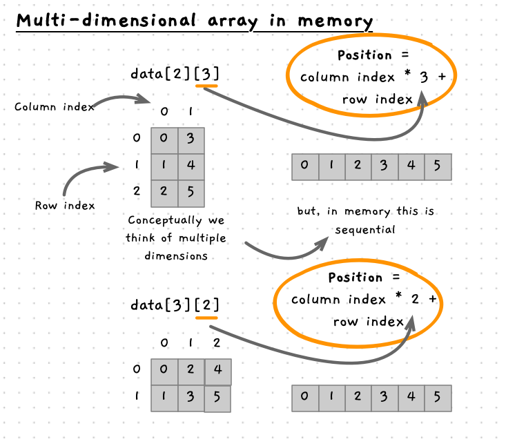
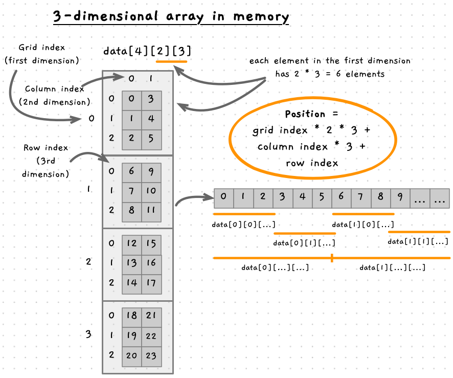

Memory allocations allow you to ask for a number of bytes, and this can be used to create arrays that contain multiple values. In some cases you may want to allocate space for a multidimensional array, so how can that be done?

## Multiple array indexes

Memory is always managed as a sequence of bytes, with each byte having an address that indicates its distance from the start of memory. So how are multidimensional arrays represented, and how could we map these to allocated memory?

Let's consider an array declared as `int data[2][3];`. This array has a total of six elements in it, and can be visualised as a grid with 2 columns, each containing 3 elements. However, in memory this is stored as six elements in sequence (next to each other in memory). We can calculate the location in this be using the index of each dimension, where the sequential position is the *column index* multiplied by the number of elements within that dimension (3 in this case). This is shown in the following image. The value at `data[0][2]` is at index `2` in the sequence, `data[1][2]` is at index `5`, and so on.

When this is taken to 3-dimensions it works the same, but now we need to map the index of each dimension based on the size of that dimension. This is shown in the following image.

