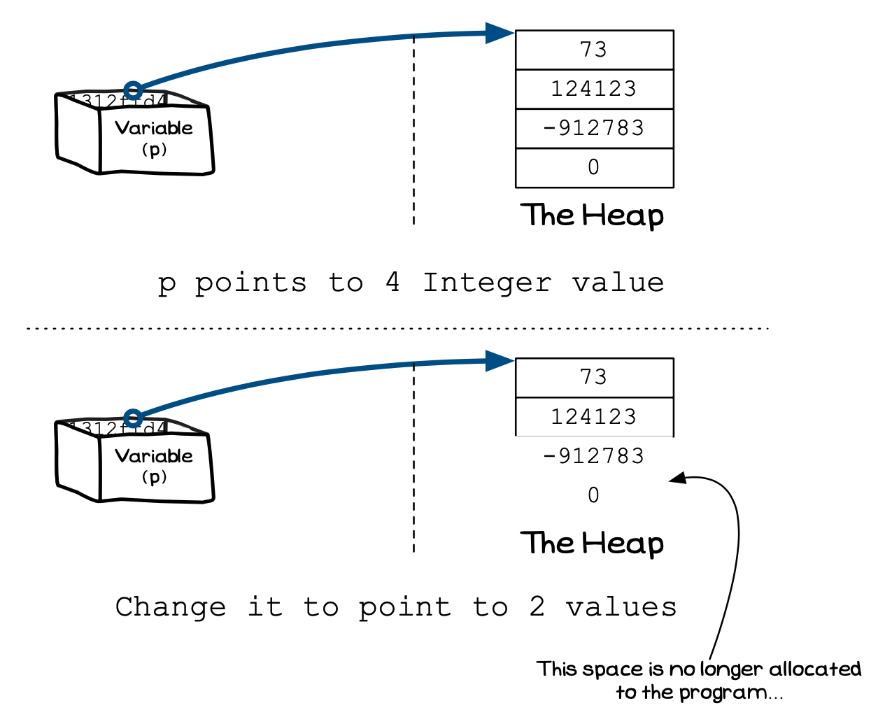

The advantage of dynamic memory allocation is that you can change your allocations. If you asked for an array of two values, you may later want to be able to expand that array to three or four elements. Alternatively, an array with twenty elements may have some data removed and be shrunk down to only 5 elements. All of this is possible with dynamic memory allocation. You can ask to have the memory you were allocated changed to a different size.

<a id="FigureArraySizeChange"></a>


<div class="caption"><span class="caption-figure-nbr">Figure x.y: </span>You can change the size of the allocation, growing or shrinking the number of element</div><br/>

:::note

- These reallocations will keep the data that was in the array previously. Obviously if the new allocation is smaller than than existing one you will lose some values, but the others are kept. 
- It is possible that the Operating System will need to move your new allocation, so if you change the size of an array you need to be careful if other pointers refer to elements in their old locations.

:::

## Realloc - Why, When, and How

You can use realloc when you have an existing heap allocation that you want to change. You may need more space, or have reduced the size you need. In either case the realloc call can let you change the allocation.

:::caution

This seems simple, but needs some thought. If you increase the size of your allocation, the operating system may need to move it elsewhere in memory. When this occurs the old space is freed. Any pointers you had going into the space will no longer be valid. So be careful with your design when reallocating things in memory.

:::

## In C/C++

Like `malloc` and `calloc`, `realloc` allows you to allocate space from the heap. Using `realloc` you can change (*reallocate*) space on the heap, by passing in the existing pointer and the new size.

|**Function** | **Required Arguments** | **Returns** | **Description** |
|-----------|------------------------|-------|---------|
| `realloc` | the pointer to reallocate, and the new `size` in bytes. | a pointer (`void *`) to the new address | Changes the memory allocation and returns a pointer to it. |

As with the other memory allocation functions, you need to import the *stdlib.h* header file. The realloc function has the following prototype:

```cpp
void *realloc( void *ptr, size_t size )
```

To use this safely you need to think about how it works:

- If it can reallocate at the same location, it will and returns the original pointer.
- If needed to move the allocation, it will do and returns the new address of the data.
- When you are out of memory, or it cannot find a new place to store the data, it will return `nullptr` / `NULL`.

To handle all three of these cases you need to make sure you do not update the original pointer value until you have checked if the realloc worked. If you get back NULL, then you need to have kept the original pointer so that you can get back to the space on the heap.

## Example

The following example shows how to use `realloc` to both allocation and then change the memory allocation. This would work equally well if you used `malloc` or `calloc` to do the original memory allocation.

```c
#include <stdlib.h>

int main()
{
    int *p = NULL;

    // get space for one integer from the heap - same as malloc
    p = (int *)realloc(p, sizeof(int));
    *p = 1; // give it a value...

    // reallocate space for 5 integers
    int *new_p;
    new_p = (int *)realloc(p, sizeof(int) * 5);
    if ( new_p != NULL )
    {
        p = new_p;
    }

    // p[0] is still 1...
    // but there is now also space for p[1]...p[4]

    // free all space allocated
    free(p);
    p = NULL;

    return 0;
}
```
<div class="caption"><span class="caption-figure-nbr">Listing x.y: </span>Example calls to <code>realloc</code></div>

Notice how we use an if statement to check if the realloc worked. If it did, we update the pointer, otherwise it retains its original value.

To make this work in reality we would need to put this in a struct where we also keep track of the size of the array as we have before.

:::note

- `realloc` allows you to *reallocate memory* for a pointer.
- You need to include **stdlib.h** to use `realloc`.
- `ptr` must be a`NULL`, or a pointer to a memory block on the heap, i.e. space previously allocated with `malloc`, `calloc`, or `realloc`. 
- `realloc` returns `NULL` if it fails to allocate memory.
- `realloc` may need to move the memory allocation, so you need to assign the result to a pointer as it may differ from the value passed to the `ptr` parameter.
:::

<!-- TODO: add slider -->
