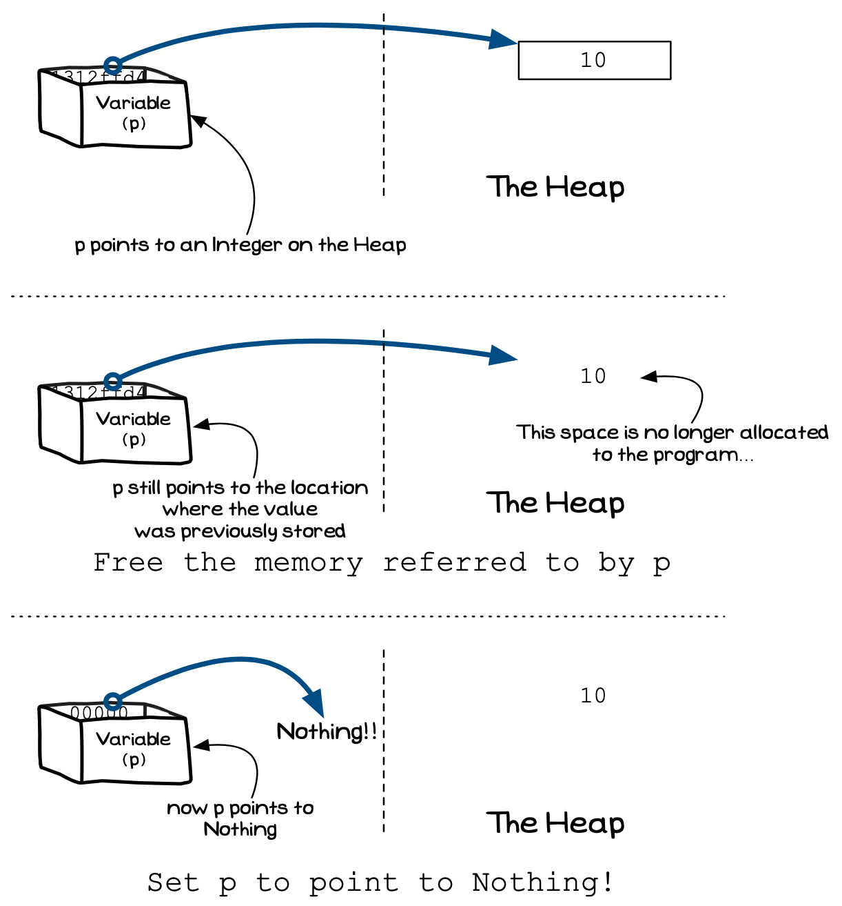

Dynamic memory allocation requires that you manage the memory you are allocated yourself. You ask to be allocated memory, and it is your responsibility to tell the operating system when you are finished with that memory. This is one of the main challenges of working with dynamically allocated memory. You need to take care to ensure that you do free the memory you have been allocated when you are finished with it, but at the same time you must make sure that you do not free the memory while it is still needed.

Figure x.y: You can ask to be allocated enough space to store one value
 

:::note[C#]

The `free` function releases the memory allocated to a pointer. To free the memory allocated to `p` as shown in [Figure x.y](#FigurePointerFreeing) you would use: `free(p); p = NULL;` This will both free the memory allocation and set `p` to point to nothing so that you cannot accidentally access it later.

:::

## Free - Why, When, and How

If you have allocated memory using `malloc`, `calloc`, or `realloc`... you need to free it. One pattern is to allocate, use, and then free memory within the same function or procedure. That way you can ensure that things get cleaned up.

Otherwise you need to have a clear design that lets everyone know when and why things are allocated, and what keeps them around. Most modern languages have moved away from you having to do this yourself, and they take care of these actions behind the scenes. Doing this yourself is great, as it will help you think about how memory is allocated even when you do not need to do it manually.

## In C/C++

When you allocate memory you are responsible for freeing that memory when you no longer require it. The `free` function allows you to do this.

|**Function** | **Required Arguments** | **Returns** | **Description** |
|-----------|------------------------|-------|---------|
| `free` | the pointer to free. | void | Returns a previous heap allocation to the operating system so it can allocate that space to others. |

Have a look at the previous examples which all include the use of the `free` procedure. Notice how we have set the freed pointer to refer to NULL immediately after freeing it. This helps ensure that you do not accidentally try to read a value via the pointer after it has been freed. Once you free the memory, it is no longer yours to use.

:::note

- `free` allows you to free the memory allocated to a pointer.
- You need to include **stdlib.h** to use `free`.
- `ptr` a pointer to a memory block on the heap, i.e. space previously allocated with `malloc`, `calloc`, or `realloc`.
- You can also pass `ptr` a `NULL` value, in which case nothing occurs.
- It is good practice to assign a `NULL` value to the pointer after freeing it.
:::
