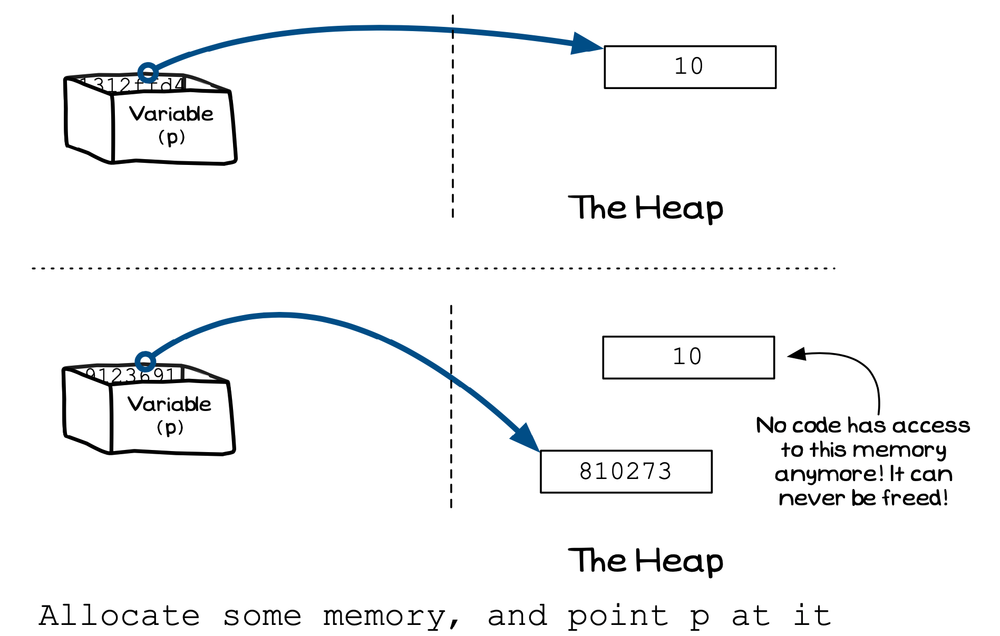

The next error is one that will not cause your program to crash, but will consume computer resources (memory) if it is allowed to run for an extended time.

Remember that with dynamic memory allocation, you are responsible for releasing allocated memory back to the system. If you do not do this, there will come a time when there is no memory left to allocate... Memory leaks are hard to detect, as they do not cause your program to crash or generate any errors in its calculations. All that happens is that over time your program consumes more and more memory.

Once again, the only way to avoid these issues is to **take care** with your pointers. You need to make sure that you know where the values are allocated, and where they are released. There should be reasons why you would the memory was allocated, and reasons why it is being released.

Figure x.y: If you <em>forget</em> a piece of allocated memory, it can never be freed!
 

:::note

Here are some tips to help you avoid memory leaks:

- Have a clear idea of where memory is allocated, and where it is freed
- Think about the pointer values in local variables at the end of each function and
procedure. Do any of these values refer to something that no other pointer does? When the function or procedure ends, the variable’s value will be lost. If it is the only thing referring to some allocated memory then that memory can no longer be freed, and you have a memory leak.

:::

For any short-lived program there are not as many issues here as all the allocated memory is freed when the program ends. This is a feature that some long-running software has used to avoid the issue. Microsoft's web server platform cycled uses an application pool that allows it to recycle (stop and start) web server processes. This helps ensure that even small memory leaks are always freed when the server process is killed. Remember that something like a web server is always running, so even small leaks become large problems over time.

As we have mentioned earlier, manual memory management is now something that is avoided by newer programming languages and tools. These environments provide extra checks and management in the background to handle memory management for you. This means that there is an overhead to this convenience, so in some performance-focused applications you may choose to have manual memory management to avoid these costs.
