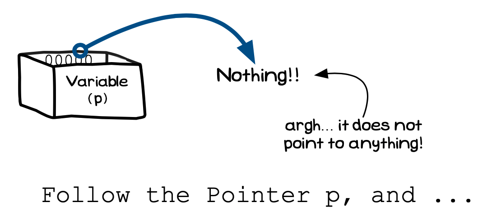

## Concept

> With great power comes great responsibility

Pointers give you great flexibility in your programs, allowing you to allocate your program more memory as you need it, and return that allocation when you are finished with it. Conceptually this seems very simple, but pointers are a source of many issues in programs.

## Access Violations

The first kind of error you are likely to encounter is caused by trying to accessing memory that does not exist. This will cause your program to crash. [Figure x.y](#FigurePointerRuntimeError) shows a common example where this occurs. Trying to follow a pointer to *Nothing* will crash the program with an access violation. This applies whether you are reading or writing to the value at the end of the pointer. The common name for this kind of error is a **segmentation fault**, *segfault* for short.

The only way to avoid these access violations is to **take care** with your pointers, see [Figure x.y](#FigurePointerCartoon). When you start working with pointers you need to go a little slower, and think a little more carefully about what it is you are doing. Having a good understanding of how these dynamic memory allocation tools work is the first step toward achieving this.

Figure x.y: Trying to follow a pointer that goes nowhere is a runtime error
 

Figure x.y: To avoid access violation, take care with your pointers. From <a href="http://xkcd.com/371/" target="_blank">http://xkcd.com/371/</a>
 

:::note

Here are some tips to help you avoid these access violations:
- If there is any doubt, check your pointers before using them.
- Always initialise your pointers to *Nothing*, as uninitialised pointers may point to something, but it wont be something useful.
- You can not see dynamically allocated memory in your code, so use a pencil and paper to sketch this out as you think through the code.

:::

## Memory Leaks

The next error is one that will not cause your program to crash, but will consume all of the computers memory if it is allowed to run for an extended time. Remember that with dynamic memory allocation you are responsible for releasing the memory back to the system. If you do not do this there will come a time when there is no memory left to allocate...Memory leaks are hard to detect, as they do not cause your program to crash or generate any errors in its calculations. All that happens is that over time it consumes more and more memory.

Once again, the only way to avoid these issues is to **take care** with your pointers. You need to make sure that you know where the values are allocated, and where they are released. There should be reasons why you would the memory was allocated, and reasons why it is being released.

Figure x.y: If you <em>forget</em> a piece of allocated memory, it can never be freed!
 

:::note

Here are some tips to help you avoid memory leaks:
- Have a clear idea of where memory is allocated, and where it is freed
- Think about the pointer values in local variables at the end of each function and
procedure. Do any of these values refer to something that no other pointer does? When the function or procedure ends, the variable’s value will be lost. If it is the only thing referring to some allocated memory then that memory can no longer be freed, and you have a memory leak.
 

:::

## Accessing Released Memory

The next error occurs when you are overly zealous about releasing memory. You must not release memory before you are finished with it. The problem occurs when you continue to access a value, after its memory has been released. This is one of the most difficult problems to locate, as it will not cause any problems initially.

Take [Figure x.y](#FigureAccessingReleasedMemory) as an example. This demonstrates a case where two pointers refer to one value. It is possible to free that value via one pointer, and then forget that the second refers to the same location. When you read the value from `p2` later, it is *likely* to still be `10`, so the program will continue to run as normal. The issue will only appear later when something else is allocated to use that piece of memory. All of a sudden the value you thought was allocated to `p2` is now changing apparently on its own. Worst of all, the actual cause of the bug could be hundred of lines of code away from where the problem appears. This is what makes this kind of error very difficult to find.

The solution, once again, is to **take care** with pointers.

Figure x.y: You can still read values from memory even when they are unallocated...
 

:::note

Here are some tips to help you avoid accessing released memory:
- When you free memory, spend some time thinking about the things that could be referring to the value you just released.

:::