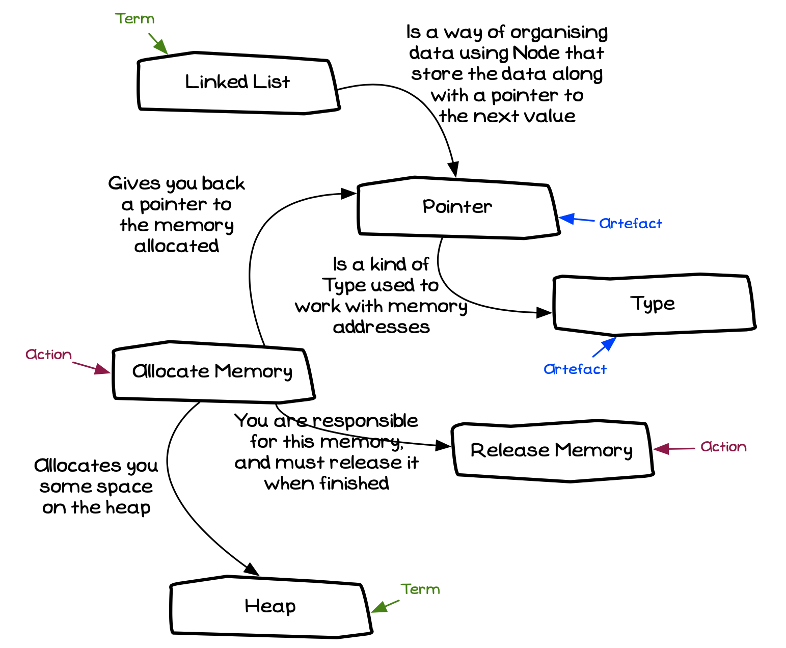

## Summary

This chapter has introduced a number of concepts related to working with pointers and per- forming dynamic memory allocation.

Figure x.y: Memory management focuses on allocating memory, releasing this allocation, pointers, and the heap
 

:::note

- [Heap](../01-heap) - an area of memory you can be allocated to store values.
- [Allocate Memory](../03-allocating-memory) - gives you ownership of a piece of the heap’s memory.
- [Release Memory](../04-freeing-memory) - once you own the memory it is yours until it is released. If you
forget to release it, it cannot be used by others.
- [Pointers](../02-pointer) - are values that point to locations in memory. They store the address of
the area of memory they refer to, and are needed to give you access to the heap.
 

:::