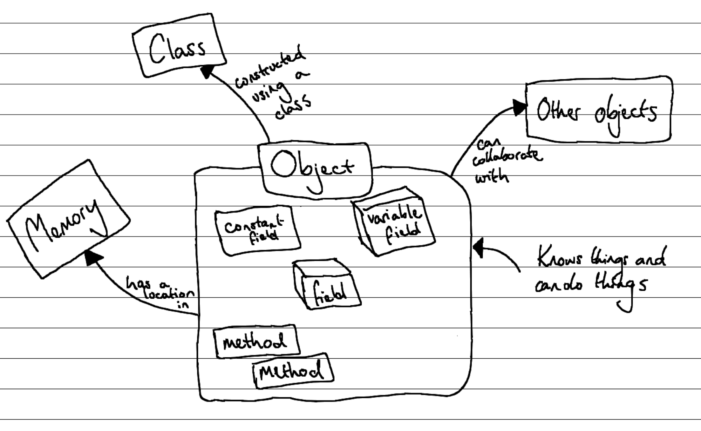

## What is an object?

<!-- 
* a class is just a description of something in terms of what it knows and does
* an entity/object is when we use the class blueprint to create something in memory
* this is an **instance** of a class
* it's like the difference between a recipe and an actual cake, or a blueprint and an actual building
-->

Figure X: An object is an entity in memory that knows and can do things
 

<!--
* if a class is a custom data type, an object is a value of that type
* you can think of an object as a big blob of memory that contains values and functionality (it's not actually, but we can use this abstraction to help us think about it)
 -->

<!-- 
Each object created from a class blueprint is self-contained.
What this means is that although we can create multiple different objects of the same type, each object has its own set of variables.
For example, if we had a `Person` class with a field called `name`, every `Person` object would have its own `name` variable.
 -->

## Using an object
<!--
* but if an object is just a big blob of data and methods, how do we actually use it?
* the code in an object doesn't run in sequence (just like procedural code with methods don't run in sequence) -- call forward to the "looking inside" section?
-->

## In C#

<!-- 
* syntax for creating a new instance of an object
* syntax for using a field, assuming it's public
* syntax for calling a method, assuming it's public
* syntax for using a property (read and write), assuming it's public and has both parts
 -->

## Example
<!-- 
* class from classes concept, creating and using it
 -->

## Activities

:::note[Summary]
:::
