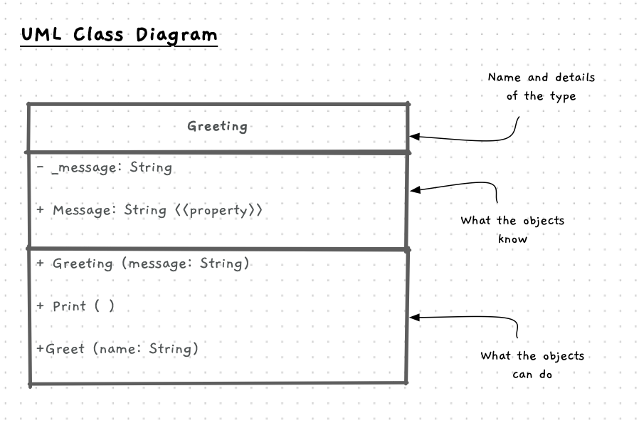

When you start building object-oriented programs you want to be able to think about and communicate your design. In order to do this, developers created a graphical notation that can be used to communicate the classes that will be part of the solution. This notation is called a **UML Class Diagram** - where UML stands for Unified Modelling Language as it brought together a number of notations into an agreed standard format.

The above diagram shows the Greeting class in UML. This diagram captures the name, and responsibilities for the Greeting class.

In this diagram, each class is represented as a box divided into three parts. At the top you have the class name, this identifies which class you are describing. Following this you have the *knows* responsibilities which will list fields and properties. The final section contains the *doing* responsibilities.

Within the diagram you can add annotations using stereotypes - the text within `<<...>>`. In the above diagram we have added a stereotype to the `Message` to indicate this is a property.

## UML Class Diagram: Why, When, and How

