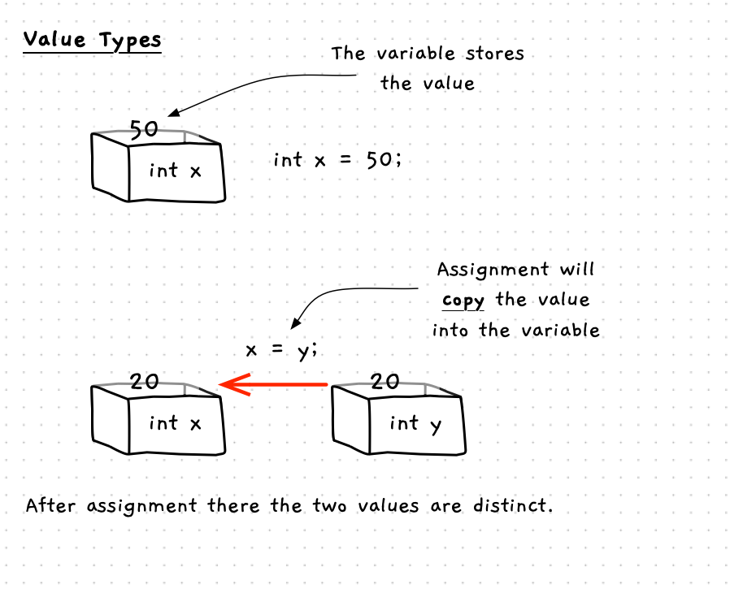
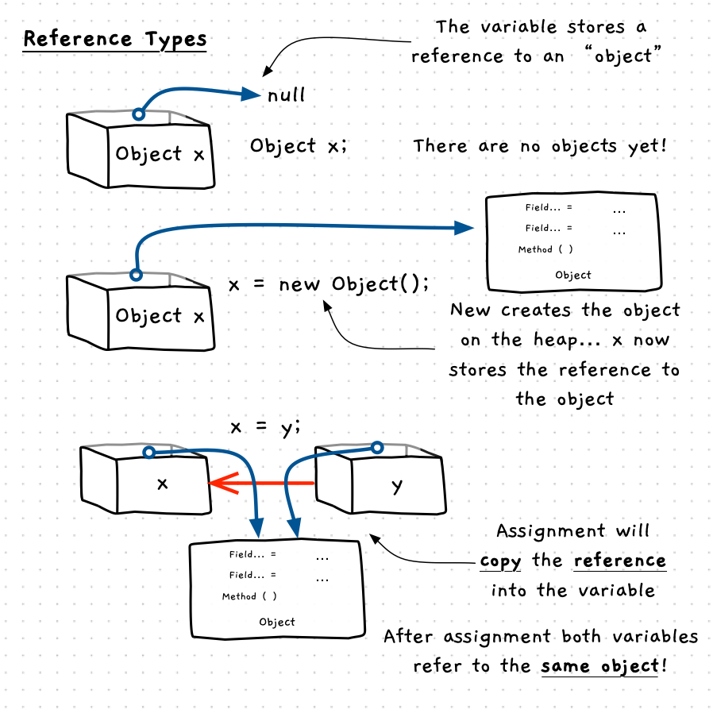

In Part 2 we looked at the idea of [pointers and references](../../../../part-2-organised-code/4-indirect-access/1-concepts/02-02-pointers-ref) and using these to indirectly access values. This idea was very powerful, but working manually with memory and memory management is very challenging.

To get around this, languages like C# give you a safer environment in which to work by focusing on references. C# does not have pointers, but instead has two kinds of variables: those that have a **value type** and those that have a **reference type**.

## Value Types

A value type variable stores a value directly - just like variables in C/C++. When you declare the variable, you are getting space to store that value. Reading the variable gets a copy of the value.

| Action | Example | Result  |
|---|---|---|
| Variable Declaration | `int x;` | You get a space to store the value  |
| Variable Assignment | `x = y;` | Value is copied from y and stored in x. There are two values in memory.  |
| Parameters  | `void Method(int x) { }` | The value is copied from y and stored in x. There are two values in memory.  |
| | `Method(y);` | |

## Reference Types

A reference type variable stores a reference to a value on the heap, equivalent to a pointer variable in C/C++. When you declare the variable, you are getting space to store a reference (pointer). Reading the variable gets a copy of the reference. To create a value of the reference type you need to use the `new` keyword. This creates the [object](../../../../part-2-organised-code/7-member-functions/1-concepts/1-0-struct-members#referring-to-struct-values-as-objects) and returns a reference.

| Action | Example | Result  |
|---|---|---|
| Variable Declaration | `Object x;` | You get a reference/pointer that can store the address of an object. At this point there are no objects in memory, and x will refer to `null`.  |
| Object Creation | `new Object();` | This creates an object on the heap and returns a reference to that location. This code will create an object in memory.  |
| Variable Assignment | `x = y;` | This copies the reference from the variable `y` and stores it in `x`. Now both `x` and `y` will refer to the same object in memory. |
| Parameters  | `void Method(Object x) { }` | The reference is copied from the argument and passed into the parameter. Now both x and y will refer to the same object in memory.  |
| | `Method(y);` | |

<!-- Set up for classes being a ref type -->
